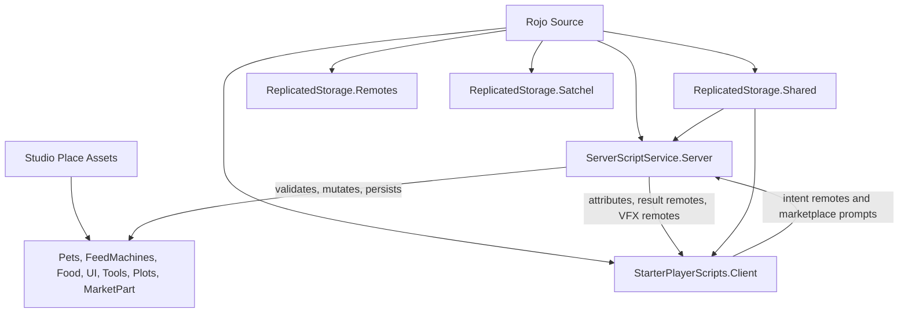

# Agent Reference

This is the orientation file for agents working on this Roblox game. Read it before changing architecture, gameplay, data, UI, remotes, or Studio assets.

Also read:

- `README.md` for Rojo build and serve basics.
- `docs/asset-workflow.md` for Studio/MCP asset ownership, backup policy, and migration order.
- `docs/publish-checklist.md` before release-facing changes.

## Project Shape

This is a hybrid Rojo + Studio game. Rojo owns code and selected source-declared services. Studio owns most runtime assets and visual structure.

The current game loop is a plot-based pet/economy game:

- players claim one plot, receive starter pets/feed-machine tools, and earn currency from pets
- food tools feed pets; XP scales pets visually and evolves them through Studio-authored pet templates
- feed machines create, process, or grow food; placed machines persist in floor-local coordinates
- currency buys market feed machines, unlocks adjacent plot grid cells, and pays for rebirth
- rebirth resets currency and pet lineup according to tier rewards while preserving the player's plot layout, placed machines, inventories, and unlocked grid cells

`default.project.json` maps:

- `src/shared` -> `ReplicatedStorage.Shared`
- `src/server` -> `ServerScriptService.Server`
- `src/client` -> `StarterPlayerScripts.Client`
- inline `ReplicatedStorage.Remotes` `RemoteEvent`s declared in JSON
- `src/satchel.rbxm` -> `ReplicatedStorage.Satchel`
- selected `Workspace`, `Lighting`, and `SoundService` property overrides

`Workspace` gameplay geometry and most templates are not Rojo-owned today. Latest MCP inspection showed the active Studio place still supplies `ReplicatedStorage.PetModels`, `FeedMachines`, `Food`, `UI`, `FeedMachineTool`, `EditTool`, `Workspace.Plots`, and `Workspace.MarketPart`.

## Studio And MCP Asset Policy

Prefer Studio-authored assets for gameplay templates, UI layouts, tools, plot geometry, market anchors, and visual structure.

Studio is the source of truth for currently Studio-owned assets. MCP is the preferred agent access path for inspecting or editing those live Studio assets, but MCP is not rollback, source control, or a second source of truth.

Studio/MCP owns:

- `ReplicatedStorage.PetModels`
- `ReplicatedStorage.FeedMachines`
- `ReplicatedStorage.Food`
- `ReplicatedStorage.UI`
- `ReplicatedStorage.FeedMachineTool`
- `ReplicatedStorage.EditTool`
- `Workspace.Plots`
- `Workspace.MarketPart`

Do not migrate `ReplicatedStorage.UI` into Rojo. `src/client/ui` is controller and presentation logic, not UI asset source. Gradual Rojo migration is non-UI only and should follow `docs/asset-workflow.md`: tools first, then pet/feed/food templates.

Current Studio asset shape observed through MCP:

- `ReplicatedStorage.PetModels` contains the active pet progression templates, keyed by `PetID` and ordered by `Order`; a previous Workspace duplicate cleanup is documented under `asset-backups/`.
- `ReplicatedStorage.FeedMachines` contains `Clicker1`, `Processor1`, `PumpkinPatch`, and tree templates such as `AppleTree`, `CherryTree`, `BananaTree`, `FigTree`, and `OrangeTree`. `FeedClass`, not folder name, is authoritative.
- `ReplicatedStorage.Food` contains recursive food template folders. Food identity is `FoodId`; broad matching uses `FoodType`.
- The inspected place currently has `Workspace.Plots.Plot1` with a starter cell and many `GridAreas`; `PlotGridService` can create an invisible runtime `Floor` if one is not already authored.
- `Workspace.MarketPart` is the touch/proximity anchor for opening and validating the market.

Before destructive, bulk, rename, restructure, or risky Studio/MCP edits, export the affected assets under `asset-backups/`.

## No-Fallback UI Policy

Do not build replacement `ScreenGui`, `Frame`, `TextLabel`, or gameplay template trees in Luau when Studio UI/templates are missing. Missing UI should warn and skip the affected path.

Allowed local presentation helpers include:

- cloning Studio-owned templates
- local attachments for prompts
- local VFX clones
- viewport preview rigs
- placement preview helpers

Non-UI gameplay assets validated by `src/server/AssetValidator.luau` can hard-fail server startup. UI issues generally warn and degrade experience. One current exception to watch: `src/client/ui/PetBillboards.luau` uses unbounded `WaitForChild` for its billboard templates, unlike most warn-and-skip UI paths.

## Server Architecture

`src/server/init.server.luau` is the server composition root, but it is more than glue today. It also owns pet feeding/evolution, pet money accrual and collection, offline earnings, edit-mode tracking, feed pickup, plot grid unlock handling, and profile snapshot helpers.

Avoid adding more major gameplay to `init.server.luau` by default. If a change adds a new subsystem or expands pet, economy, or plot behavior, consider whether a focused server module is the clearer home.

Startup order is:

1. `Remotes.validateAll()`
2. `AssetValidator.validate()`
3. `PlotGridService.ResetVacantPlotsToStarter()`
4. `RebirthService.Start()` and `MarketService.Start()`
5. player lifecycle wiring
6. `PromptInteractionService.Start(...)` and `FeedPlacementService.Start(...)`

Key server modules:

- `PlayerDataService`: ProfileStore sessions, schema reconciliation, Studio mock-store policy.
- `PlotService`: plot assignment, floor-local placement, pet/feed spawning, placement fit checks, navigation obstacle bounds, and teardown.
- `PlotGridService`: coordinate-keyed plot expansion, runtime floor creation, cell visibility/fences, unlock purchase validation, and walkable placement bounds.
- `CurrencyService`: profile `Currency`, spend/add/reset, `CurrencyUpdated`.
- `PetMotionService`: server-owned pet motion state, route refreshes, feed reactions, and packed segment attributes for client interpolation.
- `PetNavigation`: grid/A* path planning around unlocked cells and feed-machine obstacles; `PetMotionService` falls back to direct wander if unavailable.
- `feedMachines/init.luau`: registry and dispatcher for feed-machine classes.
- `feedMachines/Spawner.luau`: helper for spawned feed-machine outputs.
- `FeedPlacementService`: `PlaceFeedMachine` request handling.
- `PromptInteractionService`: thin `PromptInteract` dispatcher.
- `MarketService`: shop requests, purchases, receipt routing, state pushes, `MarketplaceService.ProcessReceipt`.
- `MarketOfferStore`: global shop cycles, live `DataStore`/`MessagingService` sync, Studio memory fallback, server override offers.
- `RebirthService`: tiered rebirth transaction and receipt handling.
- `FeedRewardService`: prepares/applies feed rewards for market/rebirth flows.
- `FeedMachineTools`: feed tool cloning and attributes.
- `NotificationService`: `PlayerNotification` wrapper.
- `AssetValidator`: startup contracts for remotes, templates, plots/grid structure, market, tools, UI, balance, and catalogs.

Gameplay authority is server-side. Clients may preview, render, and request. The server validates ownership, inventory, edit mode, state, currency, XP, evolution, placement, grid unlocks, market, rebirth, and persistence.

Security nuance: `PlaceFeedMachine` validates finite `CFrame`, plot, equipped tool, floor bounds, unlocked grid footprint, overlap, rate limits, and per-player locks, but it does not currently validate player distance to the placement location. `PromptInteractionService` validates action shape, rate limits, locks, and context; action handlers and feed-machine modules perform most ownership, target, distance, edit-mode, and state checks. Plot grid unlocks validate frontier state, price, currency, and player distance.

## Feed Machine Architecture

Templates live under Studio-owned `ReplicatedStorage.FeedMachines/<Class>/<Template>`.

Stable gameplay identity is `FeedType`. Broad behavior is `FeedClass`. Template/model names and containing folders are visual/organizational only; the folder is only the default when `FeedClass` is omitted.

`src/server/feedMachines/init.luau` indexes templates and dispatches by feed type/class. Class modules implement:

- `Setup(machine, plot, owner)`
- optional `Teardown(machine)`
- optional `Serialize(machine)`
- optional `Apply(machine, placement)`
- optional `PrePickup(machine, player)`

Interaction paths differ by class:

- Clicker: server-created `ClickDetector`, not `PromptInteract`.
- Processor: local prompt -> `PromptInteract` -> server deposit logic.
- Patch: local prompt action for harvest.
- Tree: server click behavior plus local prompt for ground pickup.

Current class behavior:

- Clicker templates spawn floor food tools on owner click, with server cooldown and max unpicked food caps.
- Processor templates accept equipped food by `FoodType`, process queue entries by wall-clock `depositedAt`, persist queues, and block pickup while queued items remain.
- Patch templates use slot anchors, cumulative XP growth chains, offline growth fractions, per-slot harvest respawn, and `PrePickup` grants current slot food back to the player.
- Tree templates use server click validation and per-slot ground piles. Clients render tree shake, falling-food visuals, respawn polish, and ground XP billboards from replicated attributes/remotes.

Feed-machine balance is split across Studio template attributes and server balance modules under `src/server/feedMachines/**`. Do not assume all tuning lives in `src/shared`. `PumpkinPatch` has an explicit patch balance module. `AppleTree` and `CherryTree` have explicit tree balance modules; other tree templates can run through the generic tree defaults if their Studio attributes are valid.

Important current caveat: `PlayerDataService` starter defaults include `BananaTree`, `FigTree`, `OrangeTree`, and `StarfruitTree`. Latest MCP inspection found templates for Banana/Fig/Orange, but not `StarfruitTree`; `AssetValidator` only requires `Clicker1`, `Processor1`, `AppleTree`, `CherryTree`, and `PumpkinPatch`. If starter inventory changes, align defaults, Studio templates, market catalog attributes, and validator requirements deliberately.

When touching feeds, foods, market catalog, or rebirth rewards, cross-check `AssetValidator`, required feed types, server balance chains, Studio template attributes, and `docs/publish-checklist.md`.

## Client Architecture

`src/client/init.client.luau` disables Roblox's default backpack so Satchel is the inventory UI, then starts UI/presentation controllers in a fixed order.

Controller categories:

- Remote-driven panels: `HudController`, `Notifications`, `MarketController`, `RebirthController`
- Attribute/render-only presentation: `PetBillboards`, `PetPreloader`, `PetAnimations`, `ToolStatsBillboard`, `SlotXPBillboard`
- Hybrid systems: `FeedPlacement`, `LocalPrompts`, `PlacementGrid`
- VFX/polish: `ProcessorVisuals`, `AppleTreeSlotVisuals`
- shared helpers: `UiEffects`

Clients clone Studio UI templates, watch replicated attributes, run local-only presentation, and send intent remotes. Client placement checks, prompt visibility, viewport previews, and button enablement are UX only; server validation remains definitive.

Pet motion is visually interpolated on the client from server-published segment attributes. `PetAnimations` reads packed `PetSegmentData`, handles corner blending, feed-reaction tilt, collect jumps, and animation speed. `PetPreloader` preloads the next pet template/animations to reduce evolution hitches. Pet billboards, slot billboards, tree visuals, and placement previews are per-client presentation, not authority.

`LocalPrompts` creates client-only `ProximityPrompt`s for pet feeding, feed pickup, processor interaction, patch harvest, tree ground pickup, and grid unlocks. It only binds prompts inside the player's assigned plot and refreshes context every 0.1 seconds, but every trigger still goes through `PromptInteract`.

`FeedPlacement` uses the equipped feed-machine tool's `FeedType`, finds the Studio template, previews placement in the plot floor's local frame, snaps position/rotation, checks unlocked grid cells and overlap locally, and sends `PlaceFeedMachine`. It prefers placement controls inside `HUD`; otherwise it clones `ReplicatedStorage.UI.FeedPlacementGui`.

`MarketController` opens from `Workspace.MarketPart` touch/overlap, requests server state, renders shop cards from server catalog payloads, prompts Robux developer products locally, and refreshes state after purchase prompts. `RebirthController` opens from HUD UI and requests server state/result remotes.

Satchel is Rojo-mapped through `src/satchel.rbxm`; no game Luau in this repo starts it directly. Do not replace Satchel with a Luau backpack unless that is an intentional product decision.

## Shared Contracts

Important shared modules:

- `Remotes.luau`: single remote registry. All current remotes are `RemoteEvent`s and must match `default.project.json`.
- `State.luau`: central replicated runtime attribute keys.
- `Interactions.luau`: valid `PromptInteract` action names.
- `Notifications.luau`: shared notification payload normalization.
- `PetCatalog`, `Food`, `MarketCatalog`: runtime/catalog helpers that read Studio-owned templates.
- `PlotGrid`: grid folder names, grid attributes, coordinate keys, fence/corner naming, and legacy plot-size migration helpers.
- `RebirthBalance`: rebirth economy.
- `MarketProducts`: developer product IDs.
- `Balance`: pet visual scaling only.
- `ProfileStore.luau`: vendored dependency. Do not edit except for intentional library upgrades.

Split replicated runtime attributes from Studio template metadata. Runtime replicated keys should go through `State.luau`; template/catalog metadata such as pet animation IDs, food `MaxXP`, and shop/template attributes may live directly on Studio instances.

`FoodId` is the stable exact food template key. `FoodType` is the broad category used by processors and old-tool compatibility. Food templates may be nested recursively under `ReplicatedStorage.Food`.

`EditMode` is a raw boolean `Player` attribute used by server and client today. It is not currently part of `State.luau`.

Primary data flow:

- Server writes attributes on replicated Instances as the main state bus.
- RemoteEvents carry client intents, request/result acknowledgements, notifications, state pushes, marketplace UI responses, and VFX triggers.
- Raw profile data stays server-side.

## Remote Policy

All remotes are declared in both `default.project.json` and `src/shared/Remotes.luau`.

Groups:

- VFX: `ProcessorDepositEffect`, `TreeClickerEffect`
- UI pushes: `PlayerNotification`, `CurrencyUpdated`
- Placement: `PlaceFeedMachine`, `PlaceFeedMachineResult`
- Interactions: `PromptInteract`
- Market: `MarketStateRequest`, `MarketStateUpdated`, `MarketPurchaseRequest`, `MarketPurchaseResult`, `MarketRestockRequest`, `MarketRestockResult`
- Rebirth: `RebirthStateRequest`, `RebirthStateUpdated`, `RebirthRequest`, `RebirthResult`

When adding a remote, update both `default.project.json` and `src/shared/Remotes.luau`, then intentionally wire server and client behavior.

Do not assume every remote is symmetric or actively fired from both sides. Some are one-way pushes, some are request/result pairs, and some market/restock behavior is driven through `MarketplaceService` receipt handling.

`MarketRestockRequest` exists but is currently stubbed/unused by the client. Real restock behavior is driven by `MarketplaceService` product purchase and server receipt processing, with `MarketRestockResult` used for result updates.

If `MarketRestockRequest` is fired manually, the server rate-limits it and replies `product-unconfigured`; the actual UI restock button calls `MarketplaceService:PromptProductPurchase` with `MarketProducts.RestockProductId`.

## Market And Rebirth

Market state is not only per-player UI data.

`MarketService` owns market requests, purchases, receipt routing, state pushes, and `MarketplaceService.ProcessReceipt`. `MarketOfferStore` owns 15-minute global shop cycles, live `DataStore`/`MessagingService` synchronization, Studio memory fallback, and server-scoped override offers after Robux restocks.

Player profile data stores per-cycle purchase counts and processed receipt ids. Market and rebirth receipt handling share receipt idempotency through profile data.

Cash purchases are server-validated through remotes and proximity to `Workspace.MarketPart`. Robux purchases/restocks are receipt-driven and must not be modeled as trusted client state.

The market catalog is generated from Studio feed templates with `InShop=true` and required shop attributes (`ShopPrice`, `ShopRarityRate`, `ShopStockRange`). `MarketProducts` currently configures the restock product and Robux feed products for `AppleTree` and `CherryTree`.

Rebirth is a specific economy transaction, not a generic wipe. Current behavior resets currency to zero, rebuilds pets according to tier rewards, increments rebirth state, grants tier feed rewards through feed reward logic, and explicitly saves on success. It preserves important player state such as placed feed machines, food inventory, plot layout, and unlocked grid cells unless another system changes them. Current `RebirthBalance` has three tiers at 1000, 5000, and 15000 currency; all skip product ids are `0`, so Robux skip is effectively disabled until configured.

## Persistence And Player Lifecycle

`PlayerDataService` uses ProfileStore with `STORE_NAME = "PlayerData"` and mock mode in Studio by default.

During a session, live plot Instances are the runtime source of truth for pets, feed placements, food inventory, feed inventory, and runtime extras. Profile tables are the persistence boundary after snapshot.

`init.server.luau` snapshots plot state back into `profile.Data` every 60 seconds, after prompt interactions, after successful placement, on leave, and during shutdown.

Do not conflate a profile snapshot with a DataStore save. Snapshotting mutates `profile.Data`; ProfileStore autosaves separately, explicit saves happen in selected flows such as Robux receipts and rebirth, and leave/shutdown closes sessions.

Profile data is server-only. Clients receive derived state through attributes and remotes.

New player defaults include one `Pet1`, zero currency, zero rebirths, starter feed-machine inventory, empty food inventory, empty placements, per-cycle market counts, receipt ids, `UnlockedGridKeys`, and `LastSeen`.

Plot expansion is saved as coordinate-key strings in `profile.Data.UnlockedGridKeys`. `PlotGridService` also migrates old `UnlockedGridIds`/`PlotSize` data, but new code should use coordinate keys.

Value-bearing data needs careful handling:

- pet `money` is per-pet collectible value
- player `Currency` is profile balance used for market purchases, plot grid unlocks, and rebirth
- server collection logic bridges pet `money` into player `Currency`

## Core Flows

Player join:

1. set up edit-mode tracking
2. assign plot
3. reset plot grid state to starter visibility
4. load profile
5. apply saved grid state, then restore pets, feed machines, machine class state, tools, inventories, and offline pet earnings
6. send initial currency, market, and rebirth state

Prompt interaction:

1. client-local prompt fires `PromptInteract`
2. dispatcher validates action shape/rate/context
3. handler validates ownership/distance/state
4. server mutates world/profile state
5. snapshot runs after interaction

Feed placement:

1. client previews placement
2. client fires `PlaceFeedMachine`
3. server validates finite `CFrame`, rate, lock, plot, tool, floor bounds, unlocked grid footprint, and overlap
4. server places and sets up the machine
5. server snapshots and replies with `PlaceFeedMachineResult`

ClickDetector interaction:

1. server-created detector receives click
2. machine logic validates owner/rate/state
3. server mutates machine state and optionally fires VFX remotes

Market/rebirth:

1. client requests state or starts purchase/rebirth flow
2. server validates currency, receipts, stock, proximity, or tier state
3. profile/world state changes
4. result/state remotes update UI

Plot grid unlock:

1. local prompt fires `PromptInteract`
2. server resolves the grid part, validates distance, frontier state, price, currency, and ownership context
3. server spends currency, saves `UnlockedGridKeys`, updates fences/visibility, and refreshes pet routes

## Engineering Rules

This is a live game. Changes should be researched, scoped, reversible where practical, and reviewed for persistence, economy, security, and player-impact risks before implementation.

Prefer simple, local changes that match existing service/module patterns. Avoid overengineering, broad rewrites, compatibility shims, speculative frameworks, and generic abstractions unless the current problem clearly needs them.

Engineer for modular growth:

- shared constants/contracts in `src/shared`
- authority in `src/server`
- presentation/controllers in `src/client/ui`
- Studio/MCP for asset-side structure and visual templates

Do not invent source-owned replacements for Studio templates. Do not create fallback UI or fallback gameplay templates in code when Studio assets are missing.

Before implementation, read the relevant modules, docs, and Studio/MCP asset state. This matters most for gameplay, persistence, economy, remotes, UI templates, asset ownership, feeds, food, market, and rebirth.

When changing shipped behavior, consider data migration, player inventory, currency, profile saves, exploit surface, rollback path, and publish checklist impact.

Preserve server authority. Validate ownership, distance where applicable, edit mode, inventory, rate limits, placement bounds, currency, profile state, and state transitions.

Add new prompt actions through `Interactions.luau`, client prompt wiring, server handlers, and validator prompt template expectations when needed.

Add new replicated runtime attributes through `State.luau` and update all readers/writers deliberately. For Studio template metadata, document the owning template/catalog path and keep validator/catalog expectations aligned.

When changing plot expansion, update `PlotGrid`, `PlotGridService`, Studio `StarterArea`/`GridAreas` attributes, client `LocalPrompts`/`FeedPlacement` expectations, persistence migration, and validator coverage together.

When changing feeds, update Studio templates and attributes, server class/balance modules, `PlayerDataService` defaults if starters change, `MarketCatalog`/`MarketProducts` if shop behavior changes, and `AssetValidator` required feed/food coverage.

Treat `ProfileStore.luau` as third-party vendored code.

There is no standardized automated Luau toolchain in the repo yet. Do not invent formatting/lint rules casually; use focused Studio playtests or validator checks for gameplay-facing changes until StyLua/Selene/Luau analysis are adopted.

Run `docs/publish-checklist.md` thinking before release-facing changes.
