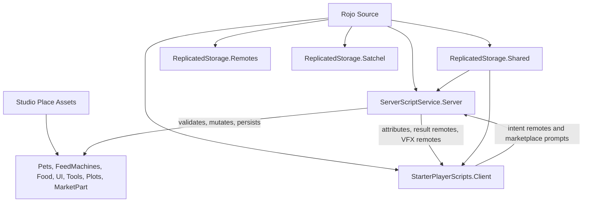

# Agent Reference

This is the orientation file for agents working on this Roblox game. Read it before changing architecture, gameplay, data, UI, remotes, or Studio assets.

Also read:

- `README.md` for Rojo build and serve basics.
- `docs/asset-workflow.md` for Studio/MCP asset ownership, backup policy, and migration order.
- `docs/publish-checklist.md` before release-facing changes.

## Project Shape

This is a hybrid Rojo + Studio game. Rojo owns code and selected source-declared services. Studio owns most runtime assets and visual structure.

`default.project.json` maps:

- `src/shared` -> `ReplicatedStorage.Shared`
- `src/server` -> `ServerScriptService.Server`
- `src/client` -> `StarterPlayerScripts.Client`
- inline `ReplicatedStorage.Remotes` `RemoteEvent`s declared in JSON
- `src/satchel.rbxm` -> `ReplicatedStorage.Satchel`
- selected `Workspace`, `Lighting`, and `SoundService` property overrides

`Workspace` gameplay geometry and most templates are not Rojo-owned today.

## Studio And MCP Asset Policy

Prefer Studio-authored assets for gameplay templates, UI layouts, tools, plot geometry, market anchors, and visual structure.

Studio is the source of truth for currently Studio-owned assets. MCP is the preferred agent access path for inspecting or editing those live Studio assets, but MCP is not rollback, source control, or a second source of truth.

Studio/MCP owns:

- `ReplicatedStorage.PetModels`
- `ReplicatedStorage.FeedMachines`
- `ReplicatedStorage.Food`
- `ReplicatedStorage.UI`
- `ReplicatedStorage.FeedMachineTool`
- `ReplicatedStorage.EditTool`
- `Workspace.Plots`
- `Workspace.MarketPart`

Do not migrate `ReplicatedStorage.UI` into Rojo. `src/client/ui` is controller and presentation logic, not UI asset source. Gradual Rojo migration is non-UI only and should follow `docs/asset-workflow.md`: tools first, then pet/feed/food templates.

Before destructive, bulk, rename, restructure, or risky Studio/MCP edits, export the affected assets under `asset-backups/`.

## No-Fallback UI Policy

Do not build replacement `ScreenGui`, `Frame`, `TextLabel`, or gameplay template trees in Luau when Studio UI/templates are missing. Missing UI should warn and skip the affected path.

Allowed local presentation helpers include:

- cloning Studio-owned templates
- local attachments for prompts
- local VFX clones
- viewport preview rigs
- placement preview helpers

Non-UI gameplay assets validated by `src/server/AssetValidator.luau` can hard-fail server startup. UI issues generally warn and degrade experience. One current exception to watch: `src/client/ui/PetBillboards.luau` uses unbounded `WaitForChild` for its billboard templates, unlike most warn-and-skip UI paths.

## Server Architecture

`src/server/init.server.luau` is the server composition root, but it is more than glue today. It also owns pet feeding/evolution, pet money accrual and collection, offline earnings, edit-mode tracking, feed pickup, plot-size upgrades, and profile snapshot helpers.

Avoid adding more major gameplay to `init.server.luau` by default. If a change adds a new subsystem or expands pet, economy, or plot behavior, consider whether a focused server module is the clearer home.

Startup order is:

1. `Remotes.validateAll()`
2. `AssetValidator.validate()`
3. `RebirthService.Start()` and `MarketService.Start()`
4. player lifecycle wiring
5. `PromptInteractionService.Start(...)` and `FeedPlacementService.Start(...)`

Key server modules:

- `PlayerDataService`: ProfileStore sessions, schema reconciliation, Studio mock-store policy.
- `PlotService`: plot assignment, plot size, floor-local placement, pet/feed spawning and teardown.
- `CurrencyService`: profile `Currency`, spend/add/reset, `CurrencyUpdated`.
- `PetMotionService`: server-owned pet motion state published through attributes.
- `feedMachines/init.luau`: registry and dispatcher for feed-machine classes.
- `feedMachines/Spawner.luau`: helper for spawned feed-machine outputs.
- `FeedPlacementService`: `PlaceFeedMachine` request handling.
- `PromptInteractionService`: thin `PromptInteract` dispatcher.
- `MarketService`: shop requests, purchases, receipt routing, state pushes, `MarketplaceService.ProcessReceipt`.
- `MarketOfferStore`: global shop cycles, live `DataStore`/`MessagingService` sync, Studio memory fallback, server override offers.
- `RebirthService`: tiered rebirth transaction and receipt handling.
- `FeedRewardService`: prepares/applies feed rewards for market/rebirth flows.
- `FeedMachineTools`: feed tool cloning and attributes.
- `NotificationService`: `PlayerNotification` wrapper.
- `AssetValidator`: startup contracts for remotes, templates, plots, market, tools, UI, balance, and catalogs.

Gameplay authority is server-side. Clients may preview, render, and request. The server validates ownership, inventory, edit mode, state, currency, XP, evolution, placement, market, rebirth, and persistence.

Security nuance: `PlaceFeedMachine` validates finite `CFrame`, plot, equipped tool, floor bounds, overlap, rate limits, and per-player locks, but it does not currently validate player distance to the placement location. `PromptInteractionService` validates action shape, rate limits, locks, and context; action handlers and feed-machine modules perform most ownership, target, distance, edit-mode, and state checks.

## Feed Machine Architecture

Templates live under Studio-owned `ReplicatedStorage.FeedMachines/<Class>/<Template>`.

Stable gameplay identity is `FeedType`. Broad behavior is `FeedClass`. Template/model names are visual only.

`src/server/feedMachines/init.luau` indexes templates and dispatches by feed type/class. Class modules implement:

- `Setup(machine, plot, owner)`
- optional `Teardown(machine)`
- optional `Serialize(machine)`
- optional `Apply(machine, placement)`
- optional `PrePickup(machine, player)`

Interaction paths differ by class:

- Clicker: server-created `ClickDetector`, not `PromptInteract`.
- Processor: local prompt -> `PromptInteract` -> server deposit logic.
- Patch: local prompt action for harvest.
- Tree: server click behavior plus local prompt for ground pickup.

Feed-machine balance is split across Studio template attributes and server balance modules under `src/server/feedMachines/**`. Do not assume all tuning lives in `src/shared`.

When touching feeds, foods, market catalog, or rebirth rewards, cross-check `AssetValidator`, required feed types, server balance chains, Studio template attributes, and `docs/publish-checklist.md`.

## Client Architecture

`src/client/init.client.luau` disables Roblox's default backpack so Satchel is the inventory UI, then starts UI/presentation controllers in a fixed order.

Controller categories:

- Remote-driven panels: `HudController`, `Notifications`, `MarketController`, `RebirthController`
- Attribute/render-only presentation: `PetBillboards`, `PetAnimations`, `ToolStatsBillboard`, `SlotXPBillboard`
- Hybrid systems: `FeedPlacement`, `LocalPrompts`, `PlacementGrid`
- VFX/polish: `ProcessorVisuals`, `AppleTreeSlotVisuals`
- shared helpers: `UiEffects`

Clients clone Studio UI templates, watch replicated attributes, run local-only presentation, and send intent remotes. Client placement checks and prompt visibility are UX only; server validation remains definitive.

Pet motion is visually interpolated on the client from server-published motion attributes. Pet billboards, slot billboards, tree visuals, and placement previews are per-client presentation, not authority.

Satchel is Rojo-mapped through `src/satchel.rbxm`; no game Luau in this repo starts it directly. Do not replace Satchel with a Luau backpack unless that is an intentional product decision.

## Shared Contracts

Important shared modules:

- `Remotes.luau`: single remote registry. All current remotes are `RemoteEvent`s and must match `default.project.json`.
- `State.luau`: central replicated runtime attribute keys.
- `Interactions.luau`: valid `PromptInteract` action names.
- `Notifications.luau`: shared notification payload normalization.
- `PetCatalog`, `Food`, `MarketCatalog`: runtime/catalog helpers that read Studio-owned templates.
- `PlotSizes`: plot tiers/prices.
- `RebirthBalance`: rebirth economy.
- `MarketProducts`: developer product IDs.
- `Balance`: pet visual scaling only.
- `ProfileStore.luau`: vendored dependency. Do not edit except for intentional library upgrades.

Split replicated runtime attributes from Studio template metadata. Runtime replicated keys should go through `State.luau`; template/catalog metadata such as pet animation IDs and some shop/template attributes may live directly on Studio instances.

`EditMode` is a raw boolean `Player` attribute used by server and client today. It is not currently part of `State.luau`.

Primary data flow:

- Server writes attributes on replicated Instances as the main state bus.
- RemoteEvents carry client intents, request/result acknowledgements, notifications, state pushes, marketplace UI responses, and VFX triggers.
- Raw profile data stays server-side.

## Remote Policy

All remotes are declared in both `default.project.json` and `src/shared/Remotes.luau`.

Groups:

- VFX: `ProcessorDepositEffect`, `TreeClickerEffect`
- UI pushes: `PlayerNotification`, `CurrencyUpdated`
- Placement: `PlaceFeedMachine`, `PlaceFeedMachineResult`
- Interactions: `PromptInteract`
- Market: `MarketStateRequest`, `MarketStateUpdated`, `MarketPurchaseRequest`, `MarketPurchaseResult`, `MarketRestockRequest`, `MarketRestockResult`
- Rebirth: `RebirthStateRequest`, `RebirthStateUpdated`, `RebirthRequest`, `RebirthResult`

When adding a remote, update both `default.project.json` and `src/shared/Remotes.luau`, then intentionally wire server and client behavior.

Do not assume every remote is symmetric or actively fired from both sides. Some are one-way pushes, some are request/result pairs, and some market/restock behavior is driven through `MarketplaceService` receipt handling.

`MarketRestockRequest` exists but is currently stubbed/unused by the client. Real restock behavior is driven by `MarketplaceService` product purchase and server receipt processing, with `MarketRestockResult` used for result updates.

## Market And Rebirth

Market state is not only per-player UI data.

`MarketService` owns market requests, purchases, receipt routing, state pushes, and `MarketplaceService.ProcessReceipt`. `MarketOfferStore` owns global shop cycles, live `DataStore`/`MessagingService` synchronization, Studio memory fallback, and server-scoped override offers after Robux restocks.

Player profile data stores per-cycle purchase counts and processed receipt ids. Market and rebirth receipt handling share receipt idempotency through profile data.

Cash purchases are server-validated through remotes and proximity to `Workspace.MarketPart`. Robux purchases/restocks are receipt-driven and must not be modeled as trusted client state.

Rebirth is a specific economy transaction, not a generic wipe. Current behavior resets/charges currency, rebuilds pets according to tier rewards, increments rebirth state, grants tier feed rewards through feed reward logic, and explicitly saves on success. It preserves important player state such as placed feed machines, plot layout, and plot size unless another system changes them.

## Persistence And Player Lifecycle

`PlayerDataService` uses ProfileStore with `STORE_NAME = "PlayerData"` and mock mode in Studio by default.

During a session, live plot Instances are the runtime source of truth for pets, feed placements, food inventory, feed inventory, and runtime extras. Profile tables are the persistence boundary after snapshot.

`init.server.luau` snapshots plot state back into `profile.Data` every 60 seconds, after prompt interactions, after successful placement, on leave, and during shutdown.

Do not conflate a profile snapshot with a DataStore save. Snapshotting mutates `profile.Data`; ProfileStore autosaves separately, explicit saves happen in selected flows such as Robux receipts and rebirth, and leave/shutdown closes sessions.

Profile data is server-only. Clients receive derived state through attributes and remotes.

New player defaults include starter pets and starter feed-machine inventory.

Value-bearing data needs careful handling:

- pet `money` is per-pet collectible value
- player `Currency` is profile balance used for market purchases, plot upgrades, and rebirth
- server collection logic bridges pet `money` into player `Currency`

## Core Flows

Player join:

1. set up edit-mode tracking
2. assign plot
3. load profile
4. restore plot, pets, feed machines, tools, and inventories
5. send initial currency, market, and rebirth state

Prompt interaction:

1. client-local prompt fires `PromptInteract`
2. dispatcher validates action shape/rate/context
3. handler validates ownership/distance/state
4. server mutates world/profile state
5. snapshot runs after interaction

Feed placement:

1. client previews placement
2. client fires `PlaceFeedMachine`
3. server validates finite `CFrame`, rate, lock, plot, tool, floor bounds, and overlap
4. server places and sets up the machine
5. server snapshots and replies with `PlaceFeedMachineResult`

ClickDetector interaction:

1. server-created detector receives click
2. machine logic validates owner/rate/state
3. server mutates machine state and optionally fires VFX remotes

Market/rebirth:

1. client requests state or starts purchase/rebirth flow
2. server validates currency, receipts, stock, proximity, or tier state
3. profile/world state changes
4. result/state remotes update UI

Plot upgrade:

1. local prompt fires `PromptInteract`
2. server validates price, currency, plot size, and ownership
3. plot size/profile state updates

## Engineering Rules

This is a live game. Changes should be researched, scoped, reversible where practical, and reviewed for persistence, economy, security, and player-impact risks before implementation.

Prefer simple, local changes that match existing service/module patterns. Avoid overengineering, broad rewrites, compatibility shims, speculative frameworks, and generic abstractions unless the current problem clearly needs them.

Engineer for modular growth:

- shared constants/contracts in `src/shared`
- authority in `src/server`
- presentation/controllers in `src/client/ui`
- Studio/MCP for asset-side structure and visual templates

Do not invent source-owned replacements for Studio templates. Do not create fallback UI or fallback gameplay templates in code when Studio assets are missing.

Before implementation, read the relevant modules, docs, and Studio/MCP asset state. This matters most for gameplay, persistence, economy, remotes, UI templates, asset ownership, feeds, food, market, and rebirth.

When changing shipped behavior, consider data migration, player inventory, currency, profile saves, exploit surface, rollback path, and publish checklist impact.

Preserve server authority. Validate ownership, distance where applicable, edit mode, inventory, rate limits, placement bounds, currency, profile state, and state transitions.

Add new prompt actions through `Interactions.luau`, client prompt wiring, server handlers, and validator prompt template expectations when needed.

Add new replicated runtime attributes through `State.luau` and update all readers/writers deliberately. For Studio template metadata, document the owning template/catalog path and keep validator/catalog expectations aligned.

Treat `ProfileStore.luau` as third-party vendored code.

Run `docs/publish-checklist.md` thinking before release-facing changes.
