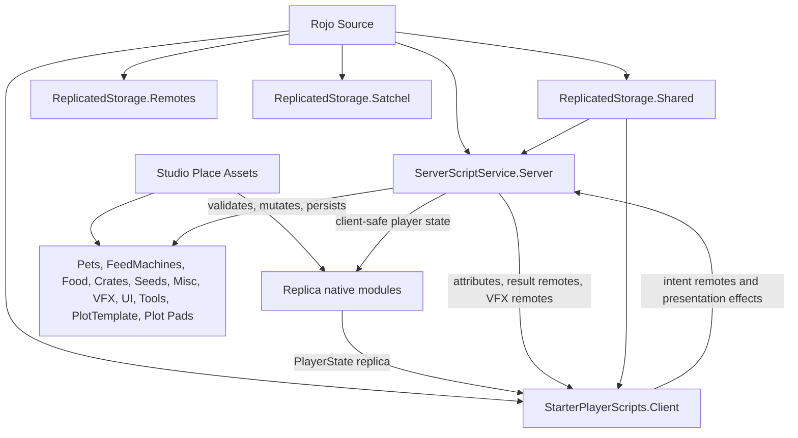

# Agent Reference

This is the orientation file for agents working on this Roblox game. Read it before changing architecture, gameplay, data, UI, remotes, or Studio assets.

Also read:

- `README.md` for Rojo build and serve basics.
- `docs/asset-workflow.md` for Studio/MCP asset ownership, backup policy, and migration order.
- `docs/publish-checklist.md` before release-facing changes.

## Project Shape

This is a hybrid Rojo + Studio game. Rojo owns code and selected source-declared services. Studio owns most runtime assets and visual structure.

The current game loop is a plot-based pet/economy game:

- players claim one plot, receive starter pets with no starter inventory tools, and earn currency from pets
- food tools feed pets; XP scales pets visually and evolves them through Studio-authored pet templates
- feed machines create, process, or grow food; placed machines persist in floor-local coordinates
- players roll crates from the plot roll area to reveal purchasable rewards such as growable seeds and misc rewards
- currency unlocks adjacent plot grid cells and pays for rebirth
- rebirth resets currency and pet lineup according to tier rewards while preserving the player's plot layout, placed machines, inventories, and unlocked grid cells

`default.project.json` maps:

- `src/shared` -> `ReplicatedStorage.Shared`
- `src/server` -> `ServerScriptService.Server`
- `src/client` -> `StarterPlayerScripts.Client`
- inline `ReplicatedStorage.Remotes` `RemoteEvent`s declared in JSON
- `src/satchel.rbxm` -> `ReplicatedStorage.Satchel`
- selected `Workspace`, `Lighting`, and `SoundService` property overrides

`Workspace` gameplay geometry and most templates are not Rojo-owned today. Latest MCP inspection showed the active Studio place supplies gameplay assets under `ReplicatedStorage.Assets` (`PetModels`, `FeedMachines`, `Food`, `Crates`, `Seeds`, `Misc`, `VFX`, `FeedMachineTool`, `SeedTool`, and `Shovel`), UI under `ReplicatedStorage.UI`, and `Workspace.PlotTemplates` loading pads. Server startup clones `ReplicatedStorage.Assets.Misc.PlotTemplate` into runtime `Workspace.Plots`.

Replica is inserted in Studio as native/vendor modules, not under Rojo source: `ServerScriptService.ReplicaServer`, `ReplicatedStorage.ReplicaClient`, and `ReplicatedStorage.ReplicaShared`. Do not edit those native Replica modules for game logic. Source code should integrate with them through project modules such as `PlayerReplicaService` and `PlayerStateStore`.

## Studio And MCP Asset Policy

Prefer Studio-authored assets for gameplay templates, UI layouts, tools, plot geometry, roll-area anchors, and visual structure.

Studio is the source of truth for currently Studio-owned assets. MCP is the preferred agent access path for inspecting or editing those live Studio assets, but MCP is not rollback, source control, or a second source of truth.

Studio/MCP owns:

- `ReplicatedStorage.Assets.PetModels`
- `ReplicatedStorage.Assets.FeedMachines`
- `ReplicatedStorage.Assets.Food`
- `ReplicatedStorage.Assets.Crates`
- `ReplicatedStorage.Assets.Seeds`
- `ReplicatedStorage.Assets.Misc`
- `ReplicatedStorage.Assets.VFX`
- `ReplicatedStorage.UI`
- `ReplicatedStorage.Assets.FeedMachineTool`
- `ReplicatedStorage.Assets.SeedTool`
- `ReplicatedStorage.Assets.Shovel`
- `ReplicatedStorage.ReplicaClient`
- `ReplicatedStorage.ReplicaShared`
- `ServerScriptService.ReplicaServer`
- `ReplicatedStorage.Assets.Misc.PlotTemplate`
- `Workspace.PlotTemplates` loading pads
- plot-local `RollArea` assets inside `PlotTemplate`, such as `RollArea.Button.Button` and `RollArea.Button.CrateFloor`

Do not migrate `ReplicatedStorage.UI` into Rojo. `src/client/ui` is controller and presentation logic, not UI asset source. Gradual Rojo migration is non-UI only and should follow `docs/asset-workflow.md`: tools first, then pet/feed/food templates.

Current Studio asset shape observed through MCP:

- `ReplicatedStorage.Assets.PetModels` contains the active pet progression templates, keyed by `PetID` and ordered by `Order`; a previous Workspace duplicate cleanup is documented under `asset-backups/`.
- `ReplicatedStorage.Assets.FeedMachines` contains `Processor1`, `PumpkinPatch`, and tree templates such as `AppleTree`, `CherryTree`, `BananaTree`, `FigTree`, and `OrangeTree`. `FeedClass`, not folder name, is authoritative.
- `ReplicatedStorage.Assets.Food` contains recursive food template folders. Food identity is `FoodId`; broad matching uses `FoodType`.
- `ReplicatedStorage.Assets.Crates` contains crate templates such as `CommonCrate` and `LuckyCrate`.
- `ReplicatedStorage.Assets.Seeds` contains roll-purchased growable seed templates with `SeedID`, target `FeedType`, `GrowTime`, `RollChanceN`, `Price`, and optional display `Rarity`.
- `ReplicatedStorage.Assets.Misc` contains non-seed runtime templates. Rollable misc rewards use `MiscID`, `RollChanceN`, `Price`, optional `DisplayName`, and optional cosmetic `Rarity`.
- `ReplicatedStorage.Assets.VFX.RarityParticle` owns the roll reveal rarity particle emitter or a container that contains it.
- `ReplicatedStorage.UI.BillboardGUIs` owns Studio-authored billboard templates, including `PlacementEdit`, `PetMoneyBillboard`, `XPBillboard`, `GrowingSeedBillboard`, `SeedRoll`, and `MiscRoll`.
- `ReplicatedStorage.UI.YesNoWarning` owns the reusable yes/no warning prompt UI.
- `ReplicatedStorage.Assets.Misc.PlotTemplate` contains the authored plot structure with a starter cell, many `GridAreas`, `GridEffect`, `SpawnLocation`, and plot-local `RollArea`; `PlotGridService` can create an invisible runtime `Floor` if one is not already authored.
- `Workspace.PlotTemplates` contains numbered loading pads (`Plot1`, `Plot2`, etc.). `src/server/PlotLoader.luau` clones the template onto those pads at server startup and parents the generated plot models under runtime `Workspace.Plots`.

Before destructive, bulk, rename, restructure, or risky Studio/MCP edits, export the affected assets under `asset-backups/`.

## No-Fallback UI Policy

Do not build replacement `ScreenGui`, `Frame`, `TextLabel`, or gameplay template trees in Luau when Studio UI/templates are missing. Missing UI should warn and skip the affected path.

Allowed local presentation helpers include:

- cloning Studio-owned templates
- local attachments for prompts
- local VFX clones
- viewport preview rigs
- placement preview helpers

Non-UI gameplay assets validated by `src/server/AssetValidator.luau` can hard-fail server startup. UI issues generally warn and degrade experience. `src/client/ui/PetBillboards.luau` now follows the warn-and-skip UI policy with bounded waits for billboard templates.

## Server Architecture

`src/server/init.server.luau` is the server composition root, but it is more than glue today. It also owns pet feeding/evolution, pet money accrual and collection, offline earnings, plot grid unlock handling, and profile snapshot helpers.

Avoid adding more major gameplay to `init.server.luau` by default. If a change adds a new subsystem or expands pet, economy, or plot behavior, consider whether a focused server module is the clearer home.

Startup order is:

1. `Remotes.validateAll()`
2. `PlotLoader.Load()` clones `ReplicatedStorage.Assets.Misc.PlotTemplate` onto `Workspace.PlotTemplates` loading pads as runtime `Workspace.Plots`
3. `AssetValidator.validate()`
4. require `ServerScriptService.ReplicaServer` so Replica can create its runtime remotes
5. `PlotGridService.ResetVacantPlotsToPreviewRows()`
6. `RebirthService.Start()`, `ReceiptService.Start(...)`, and `RollService.Start()`
7. player lifecycle wiring, including per-player `PlayerState` replica creation after profile load
8. `PromptInteractionService.Start(...)` and `FeedPlacementService.Start(...)`

Key server modules:

- `PlayerDataService`: ProfileStore sessions, schema reconciliation, Studio mock-store policy.
- `PlotLoader`: server startup cloning from the Studio-authored plot template/loading pads into runtime `Workspace.Plots`.
- `PlotService`: plot assignment, floor-local placement, pet/feed spawning, placement fit checks, per-plot feed/cosmetic placement indexes, cached navigation obstacle bounds, and teardown.
- `PlotGridService`: coordinate-keyed plot expansion, runtime floor creation, cell visibility/fences, unlock purchase validation, and walkable placement bounds.
- `CurrencyService`: profile `Currency`, spend/add/reset, and Replica-backed currency publishing.
- `PlayerReplicaService`: per-player Replica `PlayerState` creation, sanitized profile read-model publishing, ready-player subscription, and cleanup.
- `PetMotionService`: server-owned pet motion state, route refreshes, feed reactions, and packed segment attributes for client interpolation.
- `PetNavigation`: grid/A* path planning around unlocked cells and feed-machine obstacles; `PetMotionService` falls back to direct wander if unavailable.
- `feedMachines/init.luau`: registry and dispatcher for feed-machine classes.
- `feedMachines/Spawner.luau`: helper for spawned feed-machine outputs.
- `FeedPlacementService`: `PlaceFeedMachine` request handling.
- `FeedEditService`: HUD-driven edit-mode toggles and authoritative in-place mature feed-machine movement.
- `ShovelService`: server-authoritative shovel deletion for placed plant feeds.
- `PromptInteractionService`: thin `PromptInteract` dispatcher.
- `RollService`: server-authoritative crate reward rolls, roll cooldowns, pending roll offers, roll purchases, notifications, and roll VFX payloads.
- `ReceiptService`: `MarketplaceService.ProcessReceipt` routing and processed receipt idempotency.
- `RebirthService`: tiered rebirth transaction and receipt handling.
- `FeedRewardService`: prepares/applies mature feed-machine rewards for rebirth and other non-seed grants.
- `FeedMachineTools`: feed tool cloning and attributes.
- `ShovelTools`: non-persisted utility shovel cloning and identity.
- `NotificationService`: `PlayerNotification` wrapper.
- `AssetValidator`: startup contracts for remotes, Replica native modules, templates, crates, plots/grid/roll-area structure, tools, UI, balance, and catalogs.

Gameplay authority is server-side. Clients may preview, render, and request. The server validates ownership, inventory, edit mode, state, currency, XP, evolution, placement, grid unlocks, rolls, rebirth, and persistence.

Security nuance: `PlaceFeedMachine` validates finite `CFrame`, plot, equipped tool, floor bounds, unlocked grid footprint, overlap, player distance to the snapped placement location, rate limits, and per-player locks. `PromptInteractionService` validates action shape, rate limits, locks, context, and plot ancestry for targets by default; action handlers and feed-machine modules still perform detailed ownership, distance, edit-mode, and state checks. Plot grid unlocks validate frontier state, price, currency, and player distance.

Runtime service state should key players by stable `UserId` where possible, not `Player` instances or `Player.Name`. Use `Player` instances only when calling Roblox APIs, remotes, or checking current ancestry/lifecycle. Labels for diagnostics should prefer `UserId` so renames and stale instances do not affect cleanup maps, locks, cooldowns, or telemetry.

## Feed Machine Architecture

Templates live under Studio-owned `ReplicatedStorage.Assets.FeedMachines/<Class>/<Template>`.

Stable gameplay identity is `FeedType`. Broad behavior is `FeedClass`. Template/model names and containing folders are visual/organizational only; the folder is only the default when `FeedClass` is omitted.

Roll-purchased growables are Studio-owned seed templates under `ReplicatedStorage.Assets.Seeds`. Seed templates own `SeedID`, target `FeedType`, `GrowTime`, `RollChanceN`, `Price`, and optional display `Rarity`; feed-machine templates own mature behavior attributes only. Placed seeds persist as growing feed placements until `GrowTime` elapses, then mature into the existing patch/tree class behavior. Mature feed-machine tools from inventory grants or rebirth rewards still place directly.

Roll rewards are category-based. `src/shared/RollRewards.luau` owns category constants and misc reward catalog helpers. The current categories are `Seed` and `Misc`; seeds grant seed tools on purchase, while misc rewards can define future purchase behavior through server-side category handlers. Misc roll templates live under `ReplicatedStorage.Assets.Misc` and use `MiscID`, `RollChanceN`, `Price`, optional `DisplayName`, and optional cosmetic `Rarity`.

`src/server/feedMachines/init.luau` indexes templates and dispatches by feed type/class. Class modules implement:

- `Setup(machine, plot, owner)`
- optional `Teardown(machine)`
- optional `Serialize(machine)`
- optional `Apply(machine, placement)`
Interaction paths differ by class:

- Processor: local prompt -> `PromptInteract` -> server deposit logic.
- Patch: local prompt action for harvest.
- Tree: server click behavior plus local prompt for ground pickup.

Current class behavior:

- Processor templates accept equipped food by `FoodType`, process queue entries by wall-clock `depositedAt`, and persist queues.
- Patch templates use slot anchors, a `FoodDrop` exact food id, template `XP` gained every `GrowRate` seconds, uncapped XP growth with a shared offline fraction, and per-slot harvest respawn.
- Tree templates use server click validation, per-slot invisible `BaseFoodGroundN` marker state, direct marker-to-slot pickup lookup, and scheduled per-slot respawns. Server ground pile truth is replicated through marker attributes such as `TreeClickerGroundPile`, `TreeClickerSlotIndex`, `FoodId`, `FoodType`, and `XP`; clients render close-range local ground fruit, tree shake, falling-food visuals, respawn polish, and ground XP billboards from those attributes/remotes. Client-local tree fruit clones are presentation only and are tagged so prompt/index discovery ignores them.

Feed-machine balance is split across Studio template attributes and server balance modules under `src/server/feedMachines/**`. Do not assume all tuning lives in `src/shared`. Patches use generic server defaults plus Studio template attributes such as `FoodDrop`, `XP`, and `GrowRate`. `AppleTree` and `CherryTree` have explicit tree balance modules; other tree templates can run through the generic tree defaults if their Studio attributes are valid.

Important current caveat: `PlayerDataService` fresh profiles start with empty feed, seed, and food inventories. `StarfruitTree` and legacy `Clicker1` were removed from active defaults/templates. `PlayerDataService` treats those feed types as deprecated and cleans stale profile entries through its data migration/sanitization path. `AssetValidator` only requires `Processor1`, `AppleTree`, `CherryTree`, and `PumpkinPatch`. If inventory grants or the roll pool changes, align defaults, Studio templates, seed `RollChanceN`/rarity attributes, `RollChances`, and validator requirements deliberately.

When touching feeds, foods, roll odds, misc rewards, or rebirth rewards, cross-check `AssetValidator`, required feed types, server balance modules, `RollRewards`, Studio template attributes, and `docs/publish-checklist.md`.

## Client Architecture

`src/client/init.client.luau` disables Roblox's default backpack so Satchel is the inventory UI, then starts UI/presentation controllers in a fixed order.

Controller categories:

- Replica-backed player state: `PlayerStateStore`, `HudController`, `RebirthController`, `RollLuckController`, `RollDropAreaController`
- Remote-driven events/panels: `Notifications`
- Attribute/render-only presentation: `PetBillboards`, `PetPreloader`, `PetAnimations`, `ToolStatsBillboard`, `SlotXPBillboard`
- Hybrid systems: `FeedPlacement`, `FeedEditController`, `ShovelController`, `LocalPrompts`, `PlacementGrid`
- VFX/polish: `ProcessorVisuals`, `AppleTreeSlotVisuals` (generic `FeedClass = "Tree"` presentation despite the legacy file name), `RollController`
- shared helpers: `UiEffects`

Clients clone Studio UI templates, watch replicated attributes, run local-only presentation, and send intent remotes. Client placement checks, prompt visibility, viewport previews, and button enablement are UX only; server validation remains definitive.

`PlayerStateStore` starts before other UI controllers register state observers. `init.client.luau` calls `Replica.RequestData()` exactly once after controllers start, so `Replica.OnNew(PlayerState.Token, ...)` listeners are registered before initial replica data is requested. Do not call `Replica.RequestData()` from feature controllers.

Render loops must be bounded and explicitly disposable. Any `RunService.RenderStepped`/`Heartbeat` connection should disconnect when its owning GUI, plot, model, character, or controller is destroyed or no longer relevant. For collection-style systems such as pet animation, prefer one central render connection that iterates tracked pets and prunes invalid entries, instead of one render connection per pet.

Pet motion is visually interpolated on the client from server-published segment attributes. `PetAnimations` reads packed `PetSegmentData`, handles corner blending, feed-reaction tilt, collect jumps, and animation speed. `PetPreloader` preloads the next pet template/animations to reduce evolution hitches. Pet billboards, slot billboards, tree visuals, and placement previews are per-client presentation, not authority.

`LocalPrompts` creates client-only `ProximityPrompt`s for pet feeding, processor interaction, patch harvest, tree ground pickup, grid unlocks, and plot roll buttons. It binds prompt candidates from the player's assigned plot, watches plot-local descendants/marker attributes instead of global `Workspace` discovery, refreshes nearby prompt context every 0.1 seconds, and arbitrates all registered prompts so only the nearest eligible prompt is enabled. Dynamic prompts from other controllers should register through `LocalPrompts.RegisterExternalPrompt`; every gameplay trigger still goes through server validation.

`FeedPlacement` uses the equipped mature feed-machine tool's `FeedType`, or a seed tool's `SeedID` resolved through `Seeds.luau`, finds the target Studio template, previews placement in the plot floor's local frame, snaps position/rotation, checks unlocked grid cells and overlap locally, and sends `PlaceFeedMachine`. First-time placement uses the Studio-owned `ReplicatedStorage.UI.BillboardGUIs.PlacementEdit` billboard: players click an unlocked grid cell, optionally drag/rotate the preview, then confirm with the billboard button or click elsewhere to commit.

`FeedEditController` uses the Studio-owned `HUD.EditModeButton` and `ReplicatedStorage.UI.BillboardGUIs.PlacementEdit` billboard to enter edit mode, show the local `GridEffect`, select mature placed feed machines from a plot-local placeable index, preview move/rotate changes, and send target-instance move intents to the server. Growing seed placements are not selectable/movable. The server remains authoritative through `FeedEditService`; client checks are UX only.

`YesNoWarning` is a reusable client module for Studio-authored yes/no prompts backed by `ReplicatedStorage.UI.YesNoWarning`. Feature controllers provide prompt text, item text, and optional rarity data; the module clones the template into the runtime HUD and owns button effects and panel show/hide behavior.

`ShovelController` lets players equip the Studio-owned `ReplicatedStorage.Assets.Shovel` utility tool, click placed plants from a plot-local delete-target index, show `YesNoWarning`, and send confirmed delete intents. `ShovelService` validates the equipped shovel, plot ownership, plant class, distance, rate limits, and profile state before deleting. The shovel is not persisted as feed/seed/food inventory.

`RollController` listens for server roll result/effect payloads, clones Studio-owned crate and reward templates locally, plays category-specific reveal presentation, and fires the local revealed-item buy prompt back to the server. Roll reveal billboards are cloned from `ReplicatedStorage.UI.BillboardGUIs.SeedRoll` and `ReplicatedStorage.UI.BillboardGUIs.MiscRoll`; rarity particles use `ReplicatedStorage.Assets.VFX.RarityParticle`, are hidden on public replicated offers, and are distance/lifetime gated on the rolling client.

`HudController`, `RebirthController`, `RollLuckController`, and `RollDropAreaController` render durable profile-backed state from `PlayerStateStore`. They still use remotes for commands/results such as rebirth requests and upgrade purchases.

Satchel is Rojo-mapped through `src/satchel.rbxm` and started by `SatchelController` in the client controller loader. Do not replace Satchel with a Luau backpack unless that is an intentional product decision.

## Shared Contracts

Important shared modules:

- `Remotes.luau`: single remote registry. All current remotes are `RemoteEvent`s and must match `default.project.json`.
- `State.luau`: central replicated runtime attribute keys.
- `PlayerState.luau`: Replica token and field names for the sanitized per-player profile read model.
- `Interactions.luau`: valid `PromptInteract` action names.
- `Notifications.luau`: shared notification payload normalization.
- `Shovel.luau`: shared shovel tool identity constants.
- `ToolIdentity.luau`: assigns and resolves per-tool GUIDs so server actions destroy the intended equipped/backpack tool instead of matching by name.
- `PetCatalog`, `Food`, `Seeds`, `RollRewards`, `RollChances`, `RollConfig`: runtime/catalog helpers, reward category contracts, odds config, and roll presentation timing used by server/client code.
- `PlotGrid`: grid folder names, grid attributes, coordinate keys, fence/corner naming, and legacy plot-size migration helpers.
- `RebirthBalance`: rebirth economy.
- `Balance`: pet visual scaling only.
- `ProfileStore.luau`: vendored dependency. Do not edit except for intentional library upgrades.

Split replicated runtime attributes from Studio template metadata. Runtime replicated keys should go through `State.luau`; template/catalog metadata such as pet animation IDs, feed-machine `XP`, patch `FoodDrop`, patch `GrowRate`, seed `GrowTime`, reward cosmetic `Rarity`, seed/misc `RollChanceN`, seed/misc roll `Price`, and misc `MiscID` may live directly on Studio instances. Crate drop weights and luck donor behavior currently live in `RollChances.luau`.

`FoodId` is the stable exact food template key. `FoodType` is the broad category used by processors and old-tool compatibility. Food templates may be nested recursively under `ReplicatedStorage.Assets.Food`.

`EditMode` is a raw boolean `Player` attribute used by server and client today. It is not currently part of `State.luau`.

Primary data flow:

- Server writes attributes on replicated Instances for world/visual state tied to Instances.
- Replica carries durable client-safe player state through `PlayerReplicaService` and `PlayerStateStore` (`Currency`, `Rebirths`, roll upgrade levels, inventories, and unlocked grid keys today).
- RemoteEvents carry client intents, request/result acknowledgements, notifications, marketplace UI responses, and VFX/one-shot presentation triggers.
- Raw profile data stays server-side.

Do not replicate raw `profile.Data` directly. `PlayerReplicaService` builds a sanitized read model and must exclude server-only fields such as processed receipts, timestamps, pending roll offers, internal migration fields, and any anti-exploit/private data. Mutate profile truth server-side first, then publish through explicit `PlayerReplicaService` methods or `PublishProfile(...)`.

## Remote Policy

All remotes are declared in both `default.project.json` and `src/shared/Remotes.luau`.

Groups:

- VFX: `ProcessorDepositEffect`, `TreeClickerEffect`
- UI pushes: `PlayerNotification`
- Placement: `PlaceFeedMachine`, `PlaceFeedMachineResult`
- Feed editing: `FeedEditModeRequest`, `FeedMoveRequest`, `FeedMoveResult`
- Shovel deletion: `ShovelDeleteRequest`, `ShovelDeleteResult`
- Interactions: `PromptInteract`
- Roll effects/purchases: `CrateRollEffect`, `CrateRollPurchaseRequest`, `CrateRollPurchaseResult`
- Rebirth: `RebirthRequest`, `RebirthResult`

When adding a remote, update both `default.project.json` and `src/shared/Remotes.luau`, then intentionally wire server and client behavior.

Do not assume every remote is symmetric or actively fired from both sides. Some are one-way pushes, some are request/result pairs, and receipt behavior is driven through `MarketplaceService` receipt handling. Durable player state should prefer Replica over new state-push remotes; keep remotes for commands, results, notifications, effects, marketplace callbacks, and transitional compatibility.

## Rolls And Rebirth

`RollService` owns crate rolls from the plot-local roll button. The request path is a server-owned `ClickDetector` on the RollArea button; the result presentation is a `CrateRollEffect` payload to the rolling player. The server chooses the crate, builds one weighted pool across reward categories, computes weights from each reward's `RollChanceN`, applies crate luck through `RollChances`, creates short-lived pending offers priced from Studio template attributes, and fires the client effect. The client renders local revealed rewards and buy prompts, then `CrateRollPurchaseRequest` lets the server validate distance, currency, and offer freshness before dispatching to the reward category's purchase handler.

`RollChances` currently configures crate drop weights and the `LuckyCrate` rule where non-donor rewards are boosted and surplus weight is removed proportionally from the easiest donor rewards. `RollConfig` owns shared roll presentation timing, scales, VFX distance limits, and local particle lifetime used by both server cooldowns and client visuals. `Rarity` is cosmetic only and does not affect roll odds. For paid rolls, actual final odds must be disclosed before purchase and `PolicyService.ArePaidRandomItemsRestricted` must be respected.

`ReceiptService` owns processed receipt idempotency in `profile.Data.ProcessedReceipts` and routes `MarketplaceService.ProcessReceipt` to systems such as rebirth skips. Receipt-driven products must not be modeled as trusted client state.

Rebirth is a specific economy transaction, not a generic wipe. Current behavior resets currency to zero, rebuilds pets according to tier rewards, increments rebirth state, grants tier feed rewards through feed reward logic, and explicitly saves on success. It preserves important player state such as placed feed machines, food inventory, plot layout, and unlocked grid cells unless another system changes them. Current `RebirthBalance` has six tiers at 25000, 250000, 3500000, 20000000, 50000000, and 200000000 currency; all skip product ids are `0`, so Robux skip is effectively disabled until configured.

## Persistence And Player Lifecycle

`PlayerDataService` uses ProfileStore with `STORE_NAME = "PlayerData"` and mock mode in Studio by default.

During a session, live plot Instances are the runtime source of truth for pets, feed placements, growing seed placements, food inventory, seed inventory, feed inventory, and runtime extras. Profile tables are the persistence boundary after snapshot.

`init.server.luau` snapshots plot state back into `profile.Data` every 60 seconds, after prompt interactions, after successful placement, on leave, and during shutdown.

Do not conflate a profile snapshot with a DataStore save. Snapshotting mutates `profile.Data`; ProfileStore autosaves separately, explicit saves happen in selected flows such as Robux receipts and rebirth, and leave/shutdown closes sessions.

Profile data is server-only. Clients receive derived durable player state through the per-player `PlayerState` Replica, world/visual state through attributes, and one-shot events/results through remotes.

New player defaults include one `Pet1`, zero currency, zero rebirths, empty feed/seed/food inventories, empty placements, processed receipt ids, `UnlockedGridKeys`, and `LastSeen`. The shovel is a non-persisted utility tool granted by `ShovelTools`, not saved inventory.

Plot expansion is saved as coordinate-key strings in `profile.Data.UnlockedGridKeys`. `PlotGridService` also migrates old `UnlockedGridIds`/`PlotSize` data, but new code should use coordinate keys.

Value-bearing data needs careful handling:

- pet `money` is per-pet collectible value
- player `Currency` is profile balance used for plot grid unlocks and rebirth
- server collection logic bridges pet `money` into player `Currency`

## Core Flows

Player join:

1. set up edit-mode tracking
2. assign plot
3. reset plot grid state to starter visibility
4. load profile
5. apply saved grid state, then restore pets, feed machines, machine class state, tools, inventories, and offline pet earnings
6. create and subscribe the player's `PlayerState` replica
7. send command/result/effect remotes only when gameplay actions require them

Prompt interaction:

1. client-local prompt fires `PromptInteract`
2. dispatcher validates action shape/rate/context
3. handler validates ownership/distance/state
4. server mutates world/profile state
5. snapshot runs after interaction

Feed placement:

1. client previews placement
2. client fires `PlaceFeedMachine`
3. server validates finite `CFrame`, rate, lock, plot, GUID-identified equipped tool, floor bounds, unlocked grid footprint, and overlap
4. server places and sets up the machine
5. server snapshots and replies with `PlaceFeedMachineResult`

ClickDetector interaction:

1. server-created detector receives click
2. machine logic validates owner/rate/state
3. server mutates machine state and optionally fires VFX remotes

Roll/rebirth:

1. server roll button `ClickDetector` fires, or client starts a rebirth flow
2. server validates plot, distance, cooldown, profile, receipt, or tier state
3. server mutates profile/world state and dispatches purchased roll rewards or rebirth rewards when appropriate
4. result/effect/state remotes update UI or client-side presentation

Plot grid unlock:

1. local prompt fires `PromptInteract`
2. server resolves the grid part, validates distance, frontier state, price, currency, and ownership context
3. server spends currency, saves `UnlockedGridKeys`, updates fences/visibility, and refreshes pet routes

## Engineering Rules

This is a live game. Changes should be researched, scoped, reversible where practical, and reviewed for persistence, economy, security, and player-impact risks before implementation.

Prefer simple, local changes that match existing service/module patterns. Avoid overengineering, broad rewrites, compatibility shims, speculative frameworks, and generic abstractions unless the current problem clearly needs them.

Engineer for modular growth:

- shared constants/contracts in `src/shared`
- authority in `src/server`
- presentation/controllers in `src/client/ui`
- Studio/MCP for asset-side structure and visual templates

Do not invent source-owned replacements for Studio templates. Do not create fallback UI or fallback gameplay templates in code when Studio assets are missing.

Before implementation, read the relevant modules, docs, and Studio/MCP asset state. This matters most for gameplay, persistence, economy, remotes, UI templates, asset ownership, feeds, food, rolls, and rebirth.

When changing shipped behavior, consider data migration, player inventory, currency, profile saves, exploit surface, rollback path, and publish checklist impact.

Preserve server authority. Validate ownership, distance where applicable, edit mode, inventory, rate limits, placement bounds, currency, profile state, and state transitions.

Prefer `UserId` keys over `Player` instances or names for locks, cooldowns, per-player caches, replica maps, and telemetry labels. Always clear those maps on `PlayerRemoving` and profile release.

Use `RuntimeGuard`, `pcall`, or `xpcall` around Roblox API calls and other failure-prone runtime boundaries where a thrown error would kill an event connection, loop, receipt handler, prompt handler, or render/update path. Do not use protected calls to hide invalid state; validate first, fail closed, warn or report important failures, and only continue when partial success is safe.

Avoid repeated broad `Workspace:GetDescendants()` or plot descendant scans in render loops, heartbeat loops, prompt refreshes, equip/unequip paths, and action handlers. Prefer server-owned indexes for authoritative placement state, cached derived data with explicit invalidation, and plot-scoped client registries/watchers for presentation. Setup-time scans over a newly assigned plot or cloned template are acceptable when followed by event/attribute maintenance.

Add new prompt actions through `Interactions.luau`, client prompt wiring, server handlers, and validator prompt template expectations when needed.

Add new replicated runtime attributes through `State.luau` and update all readers/writers deliberately. For Studio template metadata, document the owning template/catalog path and keep validator/catalog expectations aligned.

When changing plot expansion, update `PlotGrid`, `PlotGridService`, Studio `StarterArea`/`GridAreas` attributes, client `LocalPrompts`/`FeedPlacement` expectations, persistence migration, and validator coverage together.

When changing feeds or rolls, update Studio templates and attributes, server class/balance modules, `RollRewards`, `RollChances`, `PlayerDataService` defaults if starters change, and `AssetValidator` required feed/food/crate/reward coverage.

When creating, granting, consuming, or deleting inventory tools, assign and carry a GUID through `ToolIdentity`. Server requests that consume a tool should resolve the submitted GUID and destroy that exact instance if it still matches, rather than searching by tool name or display text.

Treat `ProfileStore.luau` as third-party vendored code.

There is no standardized automated Luau toolchain in the repo yet. Do not invent formatting/lint rules casually; use focused Studio playtests or validator checks for gameplay-facing changes until StyLua/Selene/Luau analysis are adopted.

Run `docs/publish-checklist.md` thinking before release-facing changes.
