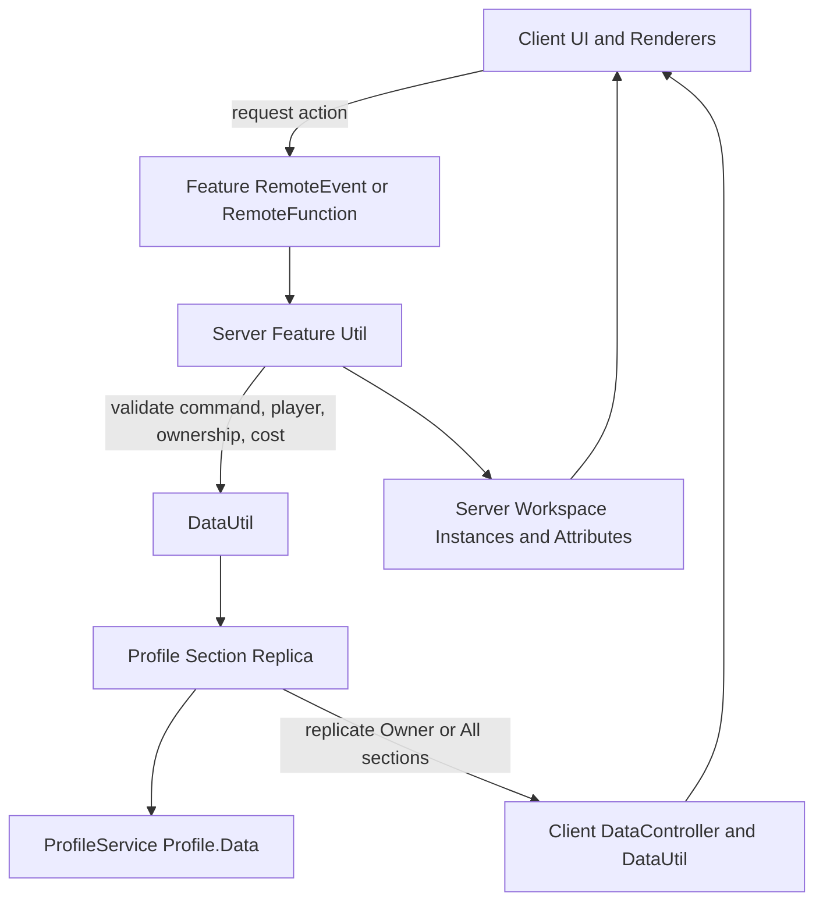

# Game Architecture Rulebook

This rulebook is for future AI agents and developers building systems for this game.

Read it as: respect the current game architecture, review and learn from it, and use that learning to build future systems with best practices. Do not rewrite the game's style just because another pattern is fashionable. Build inside the current architecture unless there is a clear reason to improve it.

Current implementation note: this repo now uses MadStudio `Replica` for client-safe player state replication. Native Replica modules live in Studio as `ServerScriptService.ReplicaServer`, `ReplicatedStorage.ReplicaClient`, and `ReplicatedStorage.ReplicaShared`; do not put game logic in those modules. Game state integration belongs in `src/server/PlayerReplicaService.luau`, `src/shared/PlayerState.luau`, and `src/client/ui/PlayerStateStore.luau`.

## Source Of Truth

The checked-in Rojo project is currently a small starter scaffold under `src/`. The real game architecture referenced by this rulebook was inspected from the open Roblox Studio place through MCP.

Use these Studio systems as the architectural examples:

- `ReplicatedStorage.Framework`: custom framework loader, module injection, `Init`, then `Start`.
- `ReplicatedStorage.Framework.Systems.DataSystem.Server.DataService`: ProfileService-backed player data loading, profile sections, lifecycle, and ReplicaService bridge.
- `ReplicatedStorage.Framework.Systems.DataSystem.DataUtil`: state access, mutation helpers, and data-change listeners.
- `ReplicatedStorage.Framework.Systems.ReplicaSystem`: profile-section replication with `Owner`, `All`, or `None` visibility.
- `ReplicatedStorage.Framework.Features.*`: feature utility modules for honey, flowers, bees, hives, events, gifts, themes, trees, and similar game systems.
- `ReplicatedStorage.Configs`: config-driven content, balance, events, rewards, packs, and shops.
- `StarterPlayer.StarterPlayerScripts.*` and `StarterGui.*`: client renderers and UI presentation.
- `ServerScriptService.ThinkingAnalytics`, `ServerScriptService.StatsService`, and `ServerScriptService.Utility.SimpleNetworkModule`: analytics, logging, HTTP, and cross-server/session support.

## Golden Rules

1. The server owns gameplay truth. Clients request actions and render results.
2. Persistent state lives in ProfileService profile sections, not random instance values or client tables.
3. Mutate profile data through `DataUtil` and replicas so saves, listeners, and clients stay consistent.
4. Choose replication intentionally: `None` for server-only sensitive data, `Owner` for personal state, `All` only for public state.
5. RemoteEvents and RemoteFunctions are not trust boundaries. Every command must be allowlisted and validated on the server.
6. Content should be config-driven through `ReplicatedStorage.Configs`, item lists, attributes, and assets instead of hardcoded one-off values.
7. UI and render scripts should be thin. They should display replicated state and send requests, not decide rewards, ownership, prices, or inventory truth.
8. Monetization rewards must be granted by server purchase handlers, never by the client after a prompt.
9. Cross-player actions need extra validation: distance, ownership, target identity, settings, cooldown, and rollback/failure behavior.
10. Key per-player runtime maps by `UserId` where possible, not `Player` instances or player names.
11. Render loops must have explicit lifetimes; collection renderers should use one loop that iterates tracked objects and prunes invalid entries.
12. Use protected runtime boundaries (`pcall`, `xpcall`, or local guard helpers) around failure-prone Roblox/API calls so one error does not kill important loops or connections.
13. Inventory tools need stable GUID identity for grants, equipped-tool resolution, and deletion.
14. Avoid repeated broad workspace/plot scans in render loops, heartbeat loops, equip paths, and action handlers. Use authoritative server indexes, cached derived data with explicit invalidation, or plot-scoped client registries instead.
15. Learn from current weak spots. Preserve the architecture, but harden migrations, remote validation, source-control sync, and tests when adding new systems.

## Architecture Flow

## 1. Client And Server Authority

**Rule:** The server is authoritative for money, inventory, placement, ownership, rewards, purchases, and cross-player effects.

**Example From This Game:** Systems like `FlowerUtil`, `HoneyUtil`, `HiveUtil`, `BeeUtil`, `CurrencyService`, and `RobuxStoreService` perform server-side data mutation. Clients call remotes or render replicated world state.

**When Building New Features:** Let the client send intent only, such as "buy this flower", "place this item here", or "claim this reward". The server must recompute whether the action is allowed and then mutate data.

## 2. RemoteEvent And RemoteFunction Security

**Rule:** Remotes use command-based APIs, but commands must be treated as untrusted input.

**Example From This Game:** Feature modules commonly expose `RemoteEvent` and `RemoteFunction` children and dispatch with `cmd` strings, such as `BuyFlower`, `PlaceFlower`, `SellHoney`, `GiveGift`, or `RequestHoneyJar`.

**When Building New Features:** Each remote should have a local allowlist of supported commands. Validate argument types, item IDs, player ownership, distance, plot bounds, cooldowns, currency, and target permissions before doing anything. Never trust client-supplied players, plots, UIDs, CFrames, item IDs, or command strings without server verification.

## 3. Data Architecture With ProfileService

**Rule:** This game uses `ProfileService` for persisted profile data. Do not call it `ProfileStore` in implementation docs unless speaking generically about profile-store-style architecture.

**Example From This Game:** `DataService` builds `DataTemplate` by letting systems call `AddProfileSection(sectionName, sectionData, replicationType)`. It then creates a ProfileService store named from the data scope and reconciles profiles on load.

**When Building New Features:** Add one clear profile section per system. Keep the template simple and serializable. Decide the replication type up front. Do not store derived visual state if it can be recomputed from persistent state.

## 4. Profile Lifecycle

**Rule:** Player systems must wait for data to load, clean up on release, and tolerate players leaving during async work.

**Example From This Game:** `DataService` loads profiles on `PlayerAdded`, calls `AddUserId`, calls `Reconcile`, builds replicas, fires `DataLoaded`, releases on `PlayerRemoving`, destroys section replicas on release, and kicks if the profile cannot be loaded or is released.

**When Building New Features:** Hook into data-loaded/data-removed lifecycle instead of assuming data exists. Cancel loops and clear caches on player removal. Prefer `UserId` keys for locks, cooldowns, session maps, replica maps, and telemetry labels; use `Player` instances only when calling Roblox APIs or checking current ancestry. Do not keep references to stale profile tables after release. For high-risk data work, add explicit handling for session conflicts and ProfileService health signals instead of relying only on library defaults.

## 5. Data Migration And Versioning

**Rule:** `Reconcile()` is enough for adding simple missing keys, but it is not a full migration system.

**Example From This Game:** Current versioning is mostly `DataUtil.DATA_SCOPE`, `DataUtil.STUDIO_DATA_SCOPE`, and ProfileService reconciliation. There is no central `DataVersion` migrator.

**When Building New Features:** Add explicit `DataVersion` handling for any breaking or structural profile changes. Write migrations that transform old data into new data once, then update the version. Use scope bumps only when intentionally starting fresh data.

## 6. Replication Architecture

**Rule:** Replication should follow the profile section's audience, not convenience.

**Example From This Game:** `DataService` creates one ReplicaService replica per profile section. Section metadata controls replication as `None`, `Owner`, or `All`. Client `DataController` assembles replicas into local `DataUtil.Data`.

**Current Rojo Implementation:** `PlayerReplicaService` creates one owner-only `PlayerState` replica per loaded player profile. It publishes a sanitized read model for durable UI state such as currency, rebirths, roll upgrade levels, inventories, and unlocked grid keys. It must not replicate raw profile tables, processed receipts, timestamps, pending offers, migration internals, or private anti-exploit state.

**When Building New Features:** Use server-only profile data for hidden inventories, anti-exploit flags, codes, and private state. Use owner-only Replica state for personal progress. Use public replication only for data other players truly need. Before adding a public replicated field, prove that every field is safe for every client to see.

## 7. UI Architecture

**Rule:** UI is presentation and input collection. It should not own game rules.

**Example From This Game:** `LocalGameUIMgr` attaches reusable local UI scripts to GUI value markers, while many `StarterGui` scripts render views, buttons, inventory, shops, subscriptions, quests, and event screens.

**When Building New Features:** Keep UI scripts local, reactive, and replaceable. They may read replicated data, listen to attributes, and fire requests. They must not decide prices, rewards, ownership, item grants, or purchase completion. Every `RenderStepped`/`Heartbeat` connection must disconnect when its owning GUI/model/plot/character is gone. For many similar render targets, such as pets, use one central render step that iterates all tracked objects and removes invalid entries, instead of creating one render connection per object.

For plot-local presentation, discover targets from the assigned plot or a known plot root, then keep a small registry current through descendant and attribute changes. Do not use global `Workspace` discovery for per-player UI unless the feature is intentionally global.

## 8. State Management

**Rule:** Use `DataUtil` and replicas as the state spine.

**Example From This Game:** `DataUtil:GetPlayerData`, `GetValue`, `SetValue`, `SetValues`, `ArrayInsert`, `ArrayRemove`, and `ListenFor` centralize state reads, writes, and subscriptions.

**Current Rojo Implementation:** Server services mutate ProfileStore-backed data at the authority point, then publish client-safe changes through explicit `PlayerReplicaService` methods or `PublishProfile(...)`. Client UI observes `PlayerStateStore`; command remotes remain for actions, results, effects, notifications, and purchases.

**When Building New Features:** Avoid direct deep writes into profile tables without also updating the relevant publisher. Use the service helper closest to the mutation so Replica, listeners, UI, and saves stay in sync. Keep cached derived state disposable and rebuildable.

## 9. Economy Architecture

**Rule:** Currency and item changes must be server-side transactions with clear sources and sinks.

**Example From This Game:** `CurrencyService:Give` and `CurrencyService:Spend` mutate `Currency` through `DataUtil` and log economy events. Feature systems call currency and item utilities instead of changing balances directly.

**When Building New Features:** Every reward, purchase, spend, conversion, and exchange should have a server source, amount, currency type, and reason. Clamp values, prevent negative balances, and log important economy movement.

## 10. Monetization Handling

**Rule:** Marketplace prompts are client-visible, but fulfillment is server-owned.

**Example From This Game:** `RobuxStoreService` handles `MarketplaceService.ProcessReceipt`, game pass purchase completion, item grants through `Items:Give`, and analytics through `ServerTGAUtil`. `SubscriptionMgr` handles subscription remotes and MarketplaceService subscription callbacks.

**When Building New Features:** Never grant paid items from a local script. Use receipt or server purchase callbacks. Make product handlers idempotent where possible. Return `NotProcessedYet` when a dev product cannot be safely granted.

## 11. Inventory Architecture

**Rule:** Inventory truth lives in data sections; tools and UI are projections.

**Example From This Game:** Flowers, honeys, bees, tree tools, themes, and similar systems store owned or placed data in profile sections. Server utilities create or update Backpack tools from that data, and the inventory UI renders tools locally.

**When Building New Features:** Store stable item IDs, counts, unique IDs, and required metadata. Rebuild tools from data on character spawn or data changes. Never rely on a client-held Tool as proof of ownership. When instancing tools, assign a GUID and require requests that consume tools to resolve and destroy the exact GUID-matching instance. Do not delete tools by searching name/display text, because duplicate tools can exist.

## 12. Trading Architecture

**Rule:** The current architecture supports gifting or limited transfers, not a full two-sided trade system.

**Example From This Game:** `GiftUtil` validates self-gifting, target settings, distance, and item ownership before moving a fertilizer or grown flower. It is a direct transfer, not a trade escrow.

**When Building New Features:** Call this pattern `gifting` unless a real trade service is built. A full trade system needs two-party offers, accept/confirm states, locked inventory, cancellation, timeout, rollback, and server-only finalization.

## 13. Anti-Exploit Architecture

**Rule:** Anti-exploit is mostly server validation, not client detection.

**Example From This Game:** Good patterns include plot ownership checks, distance checks in gifting, inventory count checks, shop stock checks, settings checks, and cooldown helpers like `CDCheckUtility`.

**When Building New Features:** Validate the invariant closest to the mutation. If a remote changes another player's state, require stricter proof: target is valid, action is allowed by design, caller is nearby or authorized, and the affected item exists server-side.

## 14. Module And Service Architecture

**Rule:** Follow the current framework lifecycle: require modules, inject dependencies, call `Init` synchronously, then call `Start` asynchronously.

**Example From This Game:** `ReplicatedStorage.Framework` discovers modules, injects `Framework`, `Modules`, `Classes`, and `IS_SERVER`, and separates server/client modules by folder ancestry.

**When Building New Features:** Put setup, references, remotes, profile sections, and signals in `Init`. Put player loops, event connections, long-running tasks, and runtime behavior in `Start`. Keep dependencies explicit through injected modules.

## 15. Networking API Design

**Rule:** Feature networking should be small, named, and documented.

**Example From This Game:** Most feature utilities own their own `RemoteEvent` or `RemoteFunction`, with commands routed by string. Shared platform remotes live under `ReplicatedStorage.Remotes`.

**When Building New Features:** Prefer one remote boundary per feature utility, not one global remote for everything. Document each command with caller, arguments, validation, result, and failure behavior. Use RemoteFunction only when the client truly needs a response.

## 16. Config-Driven Design

**Rule:** Balance and content belong in configs, item lists, assets, or attributes, not scattered script literals.

**Example From This Game:** `ReplicatedStorage.Configs` contains flower, bee, quest, reward, event, pack, subscription, theme, and shop configs. `Items` loads item lists and assigns item types.

**When Building New Features:** Add config modules for new content families. Keep config data serializable and readable. Feature code should interpret config, not duplicate it.

## 17. Analytics And Logging Architecture

**Rule:** Important player, economy, error, purchase, and performance events should be logged server-side where possible.

**Example From This Game:** `ServerTGAUtil` sends user and event analytics, `CurrencyService` logs economy events, `ClientTGAMgr` forwards client error context, and `StatsService` tracks sessions, ping, lag, and server/player metrics.

**When Building New Features:** Add analytics at the point of truth: purchase grant, item exchange, major reward, resource sink/source, error, and suspicious rejected action. Avoid logging high-frequency noise without throttling.

## 18. Error Handling And Fail States

**Rule:** Fail closed for data, purchases, and authority checks.

**Example From This Game:** Profile load failure kicks with a generic message, profile release cleans data and kicks, product receipt failures return `NotProcessedYet`, config/network calls use `pcall`, warnings, retries, or fallbacks.

**When Building New Features:** If validation fails, do nothing and optionally warn the player. If purchase fulfillment fails, do not grant partial rewards. If data is missing, wait for data-loaded lifecycle or stop safely. Use `pcall`, `xpcall`, or existing guard helpers around Roblox services, Marketplace/DataStore calls, event callbacks, render/update loops, and cleanup code where a thrown error would kill runtime behavior. Protected calls are not a replacement for validation; log meaningful failures and fail closed.

## 19. DataStore Budget And Save Strategy

**Rule:** Let ProfileService handle player profile autosaves; do not add extra save spam.

**Example From This Game:** ProfileService uses autosave and write cooldown behavior, including an autosave spread and per-key write cooldown. Other systems use DataStore or MemoryStore for config, codes, leaderboards, referrals, sheet cache, sessions, and cross-server coordination.

**When Building New Features:** Avoid per-click DataStore writes. Batch or store in profile data when possible. Use MemoryStore for short-lived cross-server state, OrderedDataStore for ranked data, and normal DataStore for durable non-profile data.

## 20. Cross-Server Architecture

**Rule:** Use cross-server services only for state that truly spans servers.

**Example From This Game:** Sheet values use HTTP, DataStore cache, and MessagingService fan-out. Stats sessions use MemoryStore. Discord webhook dedupe uses MemoryStore and MessagingService. Some game events are per-server rather than globally coordinated.

**When Building New Features:** Decide whether a system is per-server, per-player, or global. Do not accidentally make per-server events look global. Use MessagingService for notifications, MemoryStore for short-lived coordination, and DataStore for durable state.

## 21. Folder And Security Setup

**Rule:** Put code and data where Roblox replication rules support the security model.

**Example From This Game:** Shared framework and configs are in `ReplicatedStorage`. Server-only code runs under server scopes or `ServerScriptService`. Server resources can be stored in `ServerStorage` and selectively synced through resource services.

**When Building New Features:** Secrets, admin logic, receipt handling, and authoritative mutation code must stay server-side. Client modules may contain UI, rendering, and request helpers, but not private economy logic or exploit-sensitive rules.

## 22. Testing Architecture

**Rule:** Be honest: current testing is light, so new systems need practical verification checklists at minimum.

**Example From This Game:** The architecture has Studio data scopes, ProfileService mock capability through the library, config/test flags, and many systems that can be tested in Studio play sessions. There is no mature automated test suite visible in the synced repo.

**When Building New Features:** Add a small test checklist for every feature: profile load, first-time data, migrated data, remote invalid arguments, insufficient currency, duplicate requests, player leaving mid-action, receipt retry, and client reconnect/render behavior.

## Known Architecture Gaps To Improve

These are lessons learned, not reasons to abandon the architecture:

- Keep Studio and source control aligned. Future systems should be synced or clearly documented so agents can inspect the real code from the repo.
- Add explicit `DataVersion` migrations for persisted schema changes instead of relying only on `Reconcile()`.
- Harden cross-player remotes. Any action involving another player's plot, item, bee, gift, or reward needs strong server validation.
- Document remote command contracts near the owning feature module.
- Avoid broad replication unless public visibility is required. Recheck `All` sections before adding sensitive values.
- Treat stale or ignored remote commands as bugs. Remove them or implement explicit server handlers.
- Avoid shared template references during reset/import flows. Use fresh copies when replacing profile data.
- Add explicit handling for profile session conflicts, corruption, and critical DataStore states where player data safety matters.
- Build a lightweight automated or repeatable test layer around data, remotes, and purchases over time.

## New Feature Checklist

Before adding a new feature, answer these questions:

- What profile section owns its data?
- Is the section replicated as `None`, `Owner`, or `All`, and why?
- Which server module owns the feature?
- Which client scripts only render or request the feature?
- What remotes exist, and what are their allowed commands?
- What server validations protect every command?
- What configs drive prices, rewards, item IDs, timers, and limits?
- What analytics should fire on source, sink, purchase, claim, failure, or exploit rejection?
- What happens if data is not loaded, the player leaves, the purchase retries, or the server shuts down?
- What migration is needed for existing players?
- What playtest or automated test proves it works?

## Final Principle

Build like this game, but with the lessons applied: server-owned state, profile-store persistence, Replica-backed client-safe state, config-driven content, thin clients, explicit validation, clear migrations, and practical testing.
