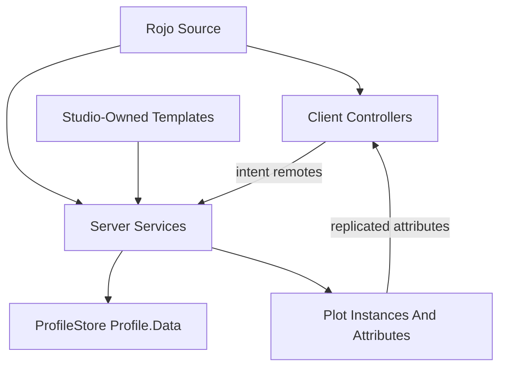

# Launch Architecture Audit

Date: 2026-05-30

This audit cross-references `docs/GAME_ARCHITECTURE_RULEBOOK.md` with this game's Rojo source and the live Studio place inspected through MCP.

The imported rulebook is useful as a set of principles, but it comes from another game. Its concrete `Framework`, `DataUtil`, `ReplicaService`, `ProfileService`, bees, flowers, hives, and `ReplicatedStorage.Configs` references should not be copied literally into this project. This game is a hybrid Rojo + Studio pet/economy game: Rojo owns Luau, remotes, Satchel, and selected service properties; Studio owns most gameplay templates, UI, and plot geometry.

## Executive Summary

The game is directionally sound for launch architecture: gameplay truth is server-side, client code mostly renders or sends intent, ProfileStore owns persistent profile sessions, remotes are centrally declared and validated, receipt handling is server-owned, and Studio assets are guarded by `AssetValidator`.

The remaining launch gaps are targeted hardening and operational items:

- Keep inventory grants and roll/rebirth rewards aligned with live Studio templates.
- Decide and document roll purchase compliance before any paid random item flow ships.
- Reduce broad client/server scans and all-plot render loops before increasing server size or plot count.
- Run focused Studio playtests for placement, prompt targeting, profile migration, and max-plot performance.

## Architecture Fit

The rulebook's core principle is correct for this game: server-owned truth, thin UI, validated remotes, stable data ownership, and practical launch checks. The implementation model differs:

- Rulebook game: Framework loader, ProfileService sections, DataUtil mutation spine, ReplicaService replication, config folders.
- This game: `src/server` services, vendored ProfileStore, direct profile tables plus live plot snapshots, replicated attributes from `State.luau`, centralized `Remotes.luau`, and Studio template attributes.

Do not introduce a Framework/DataUtil/ReplicaService migration just to match the imported rulebook. If this game eventually needs richer state replication, design it as a deliberate project with migration and performance tests.

## Rulebook Cross-Reference

| Rulebook Area | This Game Status | Launch Notes |
| --- | --- | --- |
| Server authority | Aligned | Server owns currency, pets, feed placement, grid unlocks, rolls, rebirth, receipts, and profile mutation. |
| Remote security | Improved | Central remotes and action allowlist exist. `PlaceFeedMachine` now checks player proximity, and `PromptInteract` centrally rejects targets outside the player's plot. |
| Data architecture | Adapted | Uses ProfileStore, not ProfileService sections. Single profile table is acceptable at current scale; `PlayerDataService` now has an explicit `DataVersion` migration gate. |
| Profile lifecycle | Aligned | Session cancel-on-leave, kick on load/session failure, reconciliation, and mock Studio store are present. |
| Migration/versioning | Improved | `PlayerDataService` now records `DataVersion`; grid legacy migration still lives in `PlotGridService`. |
| Replication | Adapted | No ReplicaService. Profile data stays server-side; public state uses instance attributes and selective remotes. Audit replicated attributes before adding sensitive values. |
| UI architecture | Improved | UI is Studio-owned and client controllers are presentation/intent only. `PetBillboards` and `RebirthController` now use bounded template waits and warn-and-skip behavior for Studio UI templates. |
| Economy | Improved | `CurrencyService` clamps nonnegative amounts and locks per player. `TelemetryService` now logs major sinks and purchases; high-frequency pet collection remains intentionally unlogged. |
| Monetization | Mostly aligned today | Receipt idempotency exists. Rebirth skip products are `0`, so disabled. Paid random item policy is not implemented. |
| Inventory | Aligned | Feed/food inventory lives in profile; tools are projections rebuilt or granted server-side. |
| Trading | Not applicable | No player-to-player trading/gifting system currently. |
| Anti-exploit | Improved | Ownership, distance, edit mode, currency, grid, offer checks, placement proximity, and central prompt plot scoping are now in place for the reviewed flows. |
| Module lifecycle | Adequate but pressured | Focused services exist, but `init.server.luau` still owns major pet/economy interaction logic. |
| Networking API design | Adequate | Uses dedicated remotes plus `PromptInteract` action constants. Add command contracts near services as flows grow. |
| Config-driven design | Adapted | Balance is split between shared modules, server balance modules, and Studio attributes. Keep validator coverage aligned. |
| Analytics/logging | Improved | `TelemetryService` now emits structured server logs for key economy, receipt, rebirth, roll, placement, prompt-scope, and grid-unlock events. |
| Fail states | Mostly aligned | Most invalid remotes silently reject. Receipts fail closed. UI generally warns/skips missing templates. |
| DataStore budget | Aligned | ProfileStore autosave plus in-memory snapshots avoids per-click DataStore writes. |
| Cross-server | Minimal by design | No global state except ProfileStore internals. This is fine until global events, trading, leaderboards, or server-wide offers exist. |
| Folder/security setup | Aligned | Server code under `ServerScriptService`; shared contracts in `ReplicatedStorage.Shared`; Studio-owned templates in `ReplicatedStorage`. |
| Testing | Gap but documented | `AssetValidator` and publish checklist help, but there is no automated Luau test/tooling standard yet. |

## Findings

### Resolved: Feed Placement Remote Lacked Distance Validation

Earlier review found that `src/server/FeedPlacementService.luau` validated finite CFrame, rate limits, player lock, plot ownership, equipped feed tool, floor bounds, unlocked grid footprint, and overlap before placing, but did not check that the player was near the requested placement point.

Status: `PlaceFeedMachine` now snaps the requested floor-local position, converts it back to world space, and rejects placement when the player is too far away. Client placement failures also show a specific too-far message.

Follow-up:

- Add a targeted playtest: fire placement requests at far corners, outside plot, locked grid, overlap, malformed CFrame, and during respawn.

### Resolved: Starter Feed Inventory Removed

Earlier review found that `src/server/PlayerDataService.luau` gave fresh profiles starter feed-machine tools, including stale defaults at various points. Fresh profiles now start with empty feed, seed, and food inventories.

Status: starter feed inventory defaults have been removed. `PlayerDataService` still treats `StarfruitTree` as a deprecated feed type and removes stale `StarfruitTree` feed inventory entries or saved placements during profile migration/sanitization.

Follow-up:

- If `StarfruitTree` returns later, add the full Studio template, food, roll attributes, balance, and validator coverage deliberately.
- Keep roll pool, rebirth rewards, inventory grants, feed templates, food drops, and required validator feeds aligned.

### High If Monetized: Roll Policy And Odds Disclosure Are Incomplete

Rolls are currently server-authoritative and purchased with in-game currency after a server-selected offer. `RollService` now sends server-computed effective chance text for each selected reward, but there is still no paid-random-item UI disclosure flow because rolls are not currently Robux-paid. Code does not reference `PolicyService.ArePaidRandomItemsRestricted`.

Impact: if this roll flow becomes Robux-paid, paid-random-item restricted regions or odds disclosure requirements can block launch compliance. Today this is less severe if the roll is strictly soft-currency and the player is buying a revealed result, not buying the random roll itself.

Recommendation:

- Before any Robux product or monetized mechanic related to chance ships, review the current Roblox paid-random-item policy and the latest PolicyService API for that policy.
- Check `PolicyService.ArePaidRandomItemsRestricted` or the current Roblox-supported equivalent server-side, then disable or replace restricted flows for affected users.
- Send or display final odds before the random roll purchase if the product is paid/random.
- Keep receipt-driven Robux grants server-owned through `ReceiptService`.

### Resolved: `PromptInteract` Relied On Handler-Level Target Scoping

Earlier review found that `PromptInteractionService` validated action shape, shared allowlist, rate limit, player lock, plot, and profile, then passed the client-supplied `Instance` to handlers without centrally proving that the target belonged to the player's plot.

Status: `PromptInteractionService` now centrally rejects targets that are not descendants of the player's assigned plot by default. It also logs invalid actions and wrong-plot prompt attempts through `TelemetryService`.

Follow-up:

- Keep handler-specific validation for distance, edit mode, inventory, and state.
- Document each prompt action contract near its handler as new actions are added.

### Medium: `init.server.luau` Is The Main Maintainability Pressure Point

`init.server.luau` is the composition root, but it also owns pet feeding/evolution, pet money accrual, collection, offline earnings, grid unlock dispatch, and snapshot helpers.

Impact: launch fixes can remain local, but expanding gameplay here will make security review and regression testing harder.

Recommendation:

- Do not refactor it for its own sake before launch.
- For the next substantial pet/economy change, extract focused modules such as `PetEconomyService`, `PetFeedingService`, or `ProfileSnapshotService`.
- Keep startup orchestration in `init.server.luau`; move repeatable domain rules into services.

### Improved: Explicit `DataVersion` Migrator Added

`PlayerDataService` now adds `DataVersion` to the profile template and runs explicit one-way migrations before reconciliation. Version `1` is the baseline marker for older profiles; version `2` removes deprecated `StarfruitTree` feed inventory and saved placements. `PlotGridService` still owns legacy `UnlockedGridIds`/`PlotSize` migration.

Impact: future structural changes now have a clear migration gate. Additive schema changes can still use `Reconcile()`, but profile shape changes should use a new `DataVersion` step.

Recommendation:

- Use monotonic migrations that transform old data once, then update version.
- Keep migration tests or a manual checklist with old profile fixtures.

### Improved: Analytics And Economy Logging

`TelemetryService` now emits structured server logs for key events:

- feed placement success and suspicious rejects
- invalid or wrong-plot prompt interactions
- grid unlock success/failure
- crate roll creation and purchase success/failure
- rebirth success/failure and skip receipt outcomes
- unhandled receipts

Impact: this gives launch debugging a first local audit trail without adding an external analytics dependency. It is not a replacement for a production analytics backend.

Recommendation:

- Keep logs coarse and avoid high-frequency events such as pet collection ticks.
- Replace or forward `TelemetryService` output to a real analytics sink when one is selected.
- Avoid logging per-click feed generation at high frequency without throttling.

### Improved: Client Rendering Discovery Is Mostly Plot-Scoped

Several client discovery paths were tightened after the first launch audit:

- `LocalPrompts` now binds prompt candidates from the assigned plot and plot-local marker/attribute watchers instead of global `Workspace.DescendantAdded`.
- `PatchSlotVisuals`, `SlotXPBillboard`, `TimerBillboards`, `ShovelController`, `FeedEditController`, and `OnboardingController` now build plot-local registries/caches and maintain them from plot descendant or attribute changes.
- `ToolStatsBillboard` watches equipped character tools instead of `Workspace` descendants.
- Tree ground fruit visuals are client-local close-range presentation from authoritative marker attributes, so replicated ground pile geometry no longer scales with every pile.

Remaining risk: `PetAnimations` and `PetBillboards` still track replicated pets across visible/streamed plots, and `PlacementGrid` still has a setup-time workspace normalization scan for authored grid effects. These are lower risk than the previous action-time/render-time scan paths, but should still be profiled in full-server scenarios.

Recommendation:

- Profile with a full plot count and worst-case pets/feed machines before launch.
- Filter client animation/billboard work by distance, streaming radius, or relevant plots.
- Keep new client presentation systems plot-scoped by default and avoid reintroducing global workspace discovery for per-player UI.

### Improved: Server Placement Scans And Loops Need Scale Testing

Server-side loops include pet money accrual, collection polling, snapshot polling, `PetMotionService` heartbeat, and processor queue refresh. The most expensive placement scan risk was reduced:

- `PlotService` owns per-plot feed/cosmetic placement indexes and cached navigation obstacle bounds, so `PetNavigation` route planning no longer needs `plot:GetDescendants()` through `GetSortedFeeds()` / `GetSortedCosmetics()`.
- Feed/cosmetic placement, movement, deletion, restore, maturity replacement, and teardown invalidate or update the placement indexes through `PlotService`.
- `RollService` now binds roll buttons from plot roots instead of scanning/listening to the whole workspace.
- Tree respawns use per-slot scheduled callbacks instead of an always-on 4Hz loop over every tree and slot.

Impact: the current system is bounded by plot count and likely fine for small servers. Scale risk grows with more plots, more machines per plot, and more pathfinding/route refreshes.

Recommendation:

- Run a Studio performance pass with max plots, max pets, and many placed machines.
- Watch server heartbeat, memory, route refresh frequency, and placement overlap checks.
- Keep new server gameplay indexes owned by the authority service that mutates the state; avoid parallel caches in feature modules unless they are clearly derived and disposable.

### Resolved: UI Template Waits Could Yield Forever

Most client UI paths warn and skip missing Studio templates. Earlier review found that `PetBillboards` used unbounded `WaitForChild` for `ReplicatedStorage.UI.PetMoneyBillboard` and `PetXPBillboard`. The final sanity pass also found an unbounded top-level `ReplicatedStorage.UI` wait in `RebirthController`.

Status: `PetBillboards` and `RebirthController` now use bounded waits and disable their UI paths with clear warnings if required Studio UI templates are missing or malformed.

Recommendation:

- Keep `AssetValidator` checks for billboard templates.

### Medium: Studio Console Shows Launch-Candidate Asset Issues

MCP console output showed:

- `The experience doesn't have access permission to use asset id 87879636382602`.
- Repeated Studio style warnings: `Failed to apply StyleRule property 'CornerRadius'... Unable to cast string to UDim`.
- Roblox Start Page/team-create HTTP noise that appears editor-related rather than game-runtime related.

Impact: the asset permission issue can affect visible assets/audio/animations. Style warnings may be editor/plugin/UI stylesheet noise, but repeated warnings should be reviewed before publish.

Recommendation:

- Identify asset `87879636382602` in Studio and grant experience access or replace it.
- Confirm style warnings are not from game UI assets before launch.

### Low: Tooling Version Drift

`README.md` says the project was generated by Rojo `7.7.0-rc.1`; local `rojo --version` returned `7.6.1`.

Impact: likely minor, but mismatched Rojo versions can cause confusing sync/build behavior.

Recommendation:

- Pin or document the intended Rojo version before release builds.

### Low: Workspace Contains Test-Looking Objects

MCP inspection showed `Workspace.Apple` and duplicate `Workspace.Model` humanoid rigs alongside `Workspace.Plot1`.

Impact: these may be harmless test leftovers, but launch places should avoid stray runtime assets that confuse validators, scans, or players.

Recommendation:

- Review and remove or intentionally document any non-gameplay Workspace objects before publishing.

## Positive Launch Signals

- `default.project.json` and `src/shared/Remotes.luau` agree on the remote surface.
- `Remotes.validateAll()` and `AssetValidator.validate()` run at server startup.
- Profile load handles cancel-on-leave and session loss.
- `ReceiptService` is idempotent through `ProcessedReceipts` and returns `NotProcessedYet` for unhandled products.
- Rebirth uses transactional preparation and rollback-style snapshots.
- Grid unlocks validate target, frontier, distance, price, and currency.
- Feed placement already validates many critical invariants besides distance.
- MCP confirms required core Studio asset roots exist: `PetModels`, `FeedMachines`, `Food`, `Crates`, `UI`, and `FeedMachineTool`.
- MCP confirms roll area shape exists under `Workspace.Plot1.RollArea.Button` with `Button` and `CrateFloor`.

## Studio/Rojo Alignment Notes

- Live Studio has `Workspace.Plot1` directly under `Workspace`, not `Workspace.Plots.Plot1`. Current code supports both direct plot models and a `Workspace.Plots` folder in several places.
- `ReplicatedStorage.UI` has a generic `LocalPrompt`, not a `PromptTemplates` folder. `AssetValidator` allows this.
- Feed-machine folder names are organizational. `FeedType` and `FeedClass` attributes are the stable source of truth.
- Roll/economy/growth tuning for roll-purchased growables now lives on `ReplicatedStorage.Assets.Seeds` templates (`SeedID`, `FeedType`, `GrowTime`, `RollChanceN`, `Price`, optional `Rarity`); feed templates keep mature behavior attributes such as `FeedType`, `FeedClass`, `FoodDrop`, `GrowRate`, and `XP`.
- `ReplicatedStorage.Assets.SeedTool`, `ReplicatedStorage.Assets.Misc.Sapling`, and `ReplicatedStorage.UI.BillboardGUIs.GrowingSeedBillboard` are Studio-owned runtime assets required by the seed growth flow.
- `ReplicatedStorage.UI` contains billboard/HUD/rebirth/tool/slot prompt templates, including `YesNoWarning` for reusable confirmation prompts.

## Launch Test Checklist

Run these in Studio before publishing:

- Fresh profile: joins, claims plot, gets expected starter pet and utility shovel, starts with no persisted feed/seed/food inventory tools, and receives no deprecated `StarfruitTree` entry.
- Migrated profile: old `StarfruitTree` feed inventory or placement data is removed without disturbing valid feed inventory, placements, pets, currency, receipts, or grid state.
- Rejoin profile: pets, feed placements, feed inventory, food inventory, currency, unlocked grid cells, processor queues, patch/tree states, and last seen behavior persist.
- Placement rejects malformed CFrame, far-away placement, locked grid, overlap, missing tool, wrong plot, and rapid duplicate requests; too-far rejects produce telemetry.
- Prompt interactions reject cross-plot targets, too-far targets, wrong equipped tools, edit-mode mismatches, invalid actions, and repeated spam; invalid/wrong-plot rejects produce telemetry.
- Roll flow: cooldown, server-chosen result, offer expiry, distance on purchase, insufficient currency, duplicate purchase, and grant rollback.
- Rebirth flow: insufficient currency, exact-price success, rewards, pet reset, preserved placements/inventories/grid, receipt skip disabled with product id `0`.
- Receipt retry: unhandled product returns `NotProcessedYet`; processed receipt is not double-granted.
- UI missing-template simulation: noncritical UI warns/skips, no fallback UI is generated.
- Performance run: max plots, max pets, many feed machines, active pet movement, rolls, placement previews, and prompt refreshes.
- Studio output: no asset permission errors, no infinite-yield warnings, no missing template warnings, no duplicate feed type warnings.

## Recommended Action Order

1. Decide roll monetization policy/API handling and odds disclosure before any paid random item launch.
2. Keep `StarfruitTree` removed from starter data unless the full asset/content path is reintroduced.
3. Review Studio console asset permission and stray Workspace objects.
4. Add a new `DataVersion` migration before any future structural profile change.
5. Profile client and server with max plots before scaling server size or content density.
